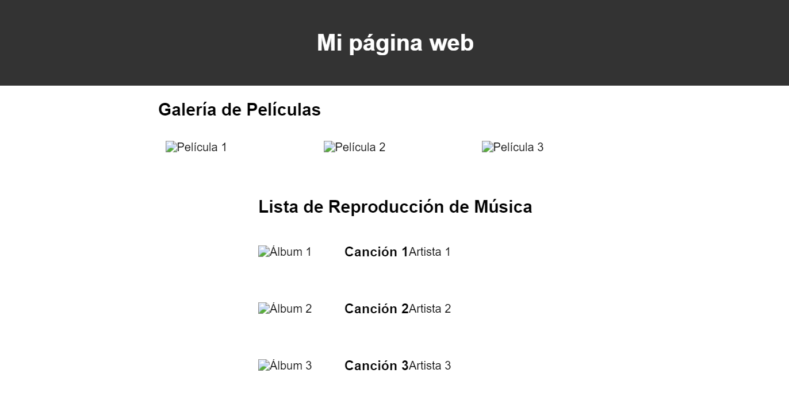
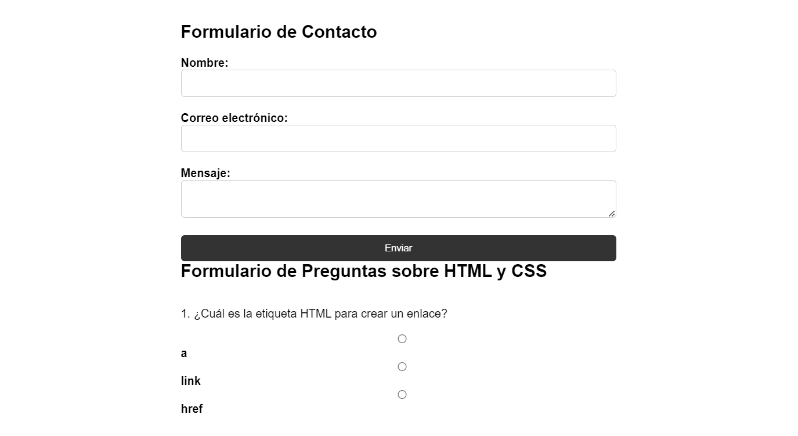
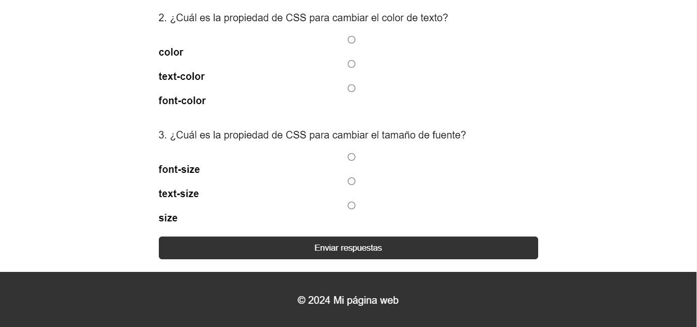

# Tarea

**Tarea práctica: Diseño de una página web, galería + formulario y aplicación de conceptos**

### **Instrucciones:**

Crea una página web que incluya una galería de películas, una lista de reproducción de música y dos formularios: uno de contacto y otro de preguntas sobre HTML y CSS. La página debe cumplir con los siguientes requisitos:

**Galería de Películas:**

- Utiliza Flexbox para organizar las películas en filas.
- Configura la dirección de apilamiento para que las películas se muestren en filas horizontales.
- Alinea las películas al centro horizontalmente y al inicio verticalmente.
- Establece un margen entre las películas para mejorar la presentación.
- Asegúrate de que las imágenes de las películas se ajusten automáticamente al tamaño del contenedor y mantengan su relación de aspecto.

**Lista de reproducción de música:**

- Crea una lista de reproducción de música con las portadas de los álbumes, los nombres de las canciones y los artistas.
- Utiliza Flexbox para organizar los elementos de la lista en filas.
- Alinea los elementos de la lista al centro horizontalmente y al inicio verticalmente.
- Establece un margen entre los elementos de la lista para mejorar la presentación.
- Asegúrate de que las portadas de los álbumes se ajusten automáticamente al tamaño del contenedor y mantengan su relación de aspecto.

**Formulario de contacto:**

- Crea un formulario de contacto con los siguientes campos:
    - Nombre
    - Correo electrónico
    - Mensaje
- Estiliza el formulario utilizando CSS para que sea atractivo y fácil de usar.
- Utiliza etiquetas HTML semánticas y selectores de CSS adecuados.
- Asegúrate de que el formulario sea responsive y se vea bien en dispositivos móviles y de escritorio.

**Formulario de preguntas sobre HTML y CSS:**

- Crea un formulario con preguntas básicas de selección sobre los temas de HTML y CSS aplicados en esta tarea.
- Incluye al menos tres preguntas sobre HTML y tres preguntas sobre CSS.
- Estiliza el formulario utilizando CSS para que sea atractivo y fácil de usar.
- Utiliza etiquetas HTML semánticas y selectores de CSS adecuados.
- Asegúrate de que el formulario sea responsive y se vea bien en dispositivos móviles y de escritorio.

**Consideraciones adicionales:**

- Utiliza HTML semántico para estructurar tu página web.
- Experimenta con diferentes valores para las propiedades Flexbox para lograr un diseño atractivo y funcional.
- Utiliza media queries para garantizar que tu página sea responsive y se vea bien en dispositivos móviles y de escritorio.
- Asegúrate de probar tu página en varios dispositivos y tamaños de pantalla para garantizar su compatibilidad y usabilidad.
- Utiliza comentarios en tu código HTML y CSS para explicar la estructura y el propósito de tus elementos y reglas de estilo.

