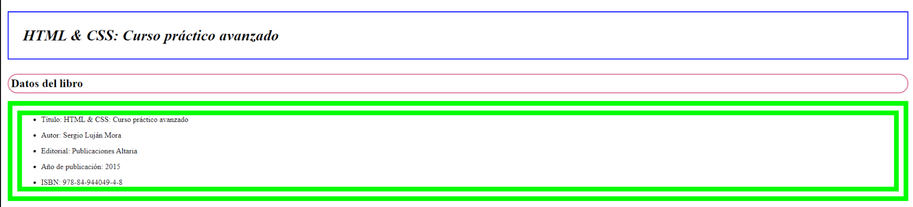
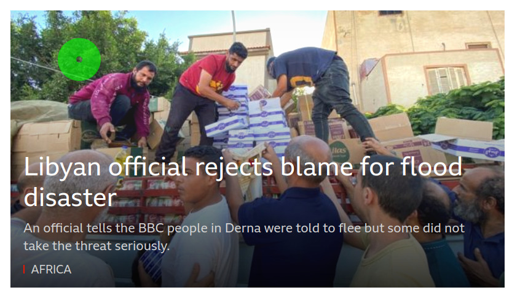

# Tareas del módulo

Las tareas de los módulos son pensadas para profundizar en los temas expuestos e interiorizar más el conocimiento.

## Tareas

En la generación de estilos hay infinitas maneras de llegar a un mismo resultado, así es que el punto de estas tareas es que pongas en práctica el conocimiento y generes estructuras utilizadas frecuentemente en páginas web de producción, no es necesario tener la respuesta 100% igual a la propuesta. Los ejercicios cuentan con solución la cual se recomienda ver solo si te atascas o si ya terminaste el ejercicio.

1. Dada la siguiente estructura de página intenta replicarla 
   - 

2. Ahora intenta replicar el siguinete contenedor de noticias de la BBC. Para ello
usa la siguiente imágen de fondo https://ichef.bbc.co.uk/wwhp/999/cpsprodpb/125E8/production/_131104257_resize.jpg. Recuerda usar la propiedad de CSS `background-image: url("<RUTA_IMAGEN>")` y `background-size: cover`. 

- 

**NOTA**: Usa los conocimientos que tenemos hasta el momento, por ejemplo si no sabes como hacer este espacio puedes usar algunas etiquetas ` ` en HTML para lograr este espacio:

