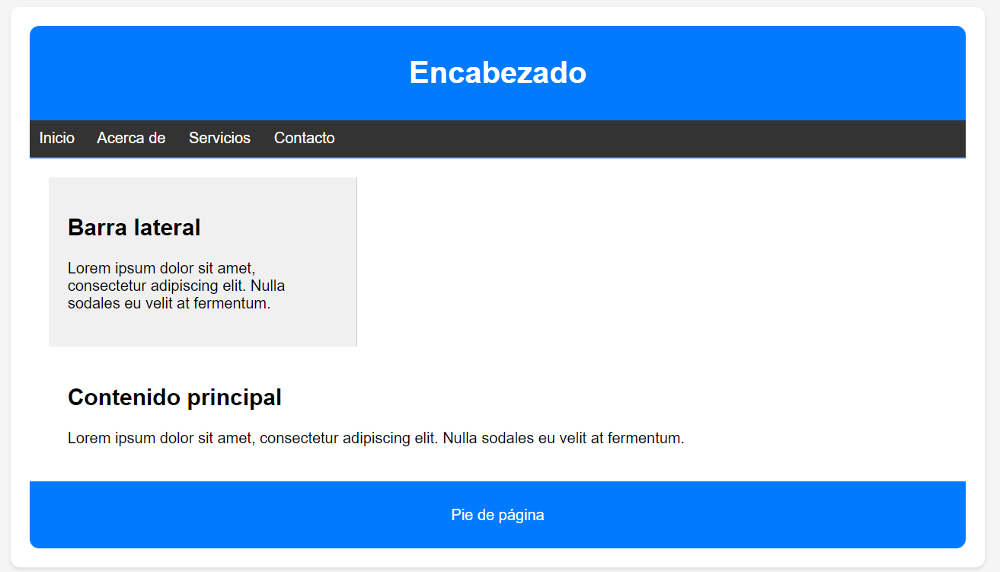

# Tarea clase #6

Las tareas de los módulos son pensadas para profundizar en los temas expuestos e interiorizar más el conocimiento.

## Tarea

Usando las propiedades de CSS vistas sobre el concepto de box model o modelo de caja intenta replicar el siguiente diseño web:   

Concepto libre → Aplicación estilos.

1. Dada la siguiente estructura de página intenta replicarla 
   - 