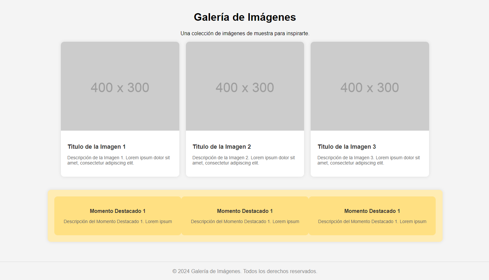

# Tarea

## Tarea Práctica: Diseño de una galería de imágenes con Flexbox

Crea una galería de imágenes flexbox que cumpla con los siguientes requisitos:

**Estructura HTML:**

- Utiliza una estructura HTML para representar la galería de imágenes.
- Cada imagen debe estar contenida en un elemento `
` con una clase.

**Estilo CSS:**

- Utiliza Flexbox para organizar las imágenes en filas.
- Configura la dirección de apilamiento para que las imágenes se muestren en filas horizontales.
- Alinea las imágenes al centro horizontalmente y al inicio verticalmente.
- Establece un margen entre las imágenes para mejorar la presentación.
- Asegúrate de que las imágenes se ajusten automáticamente al tamaño del contenedor y mantengan su relación de aspecto.

**Orden de las imágenes:**

- Cambia el orden de visualización de al menos una imagen utilizando la propiedad `order`.

**Consideraciones adicionales:**

- Puedes utilizar imágenes de ejemplo o crear tus propias imágenes para la galería.
- Experimenta con diferentes valores para las propiedades Flexbox para lograr un diseño atractivo y funcional.
- Asegúrate de probar tu galería en varios dispositivos y tamaños de pantalla para garantizar su compatibilidad y usabilidad.
