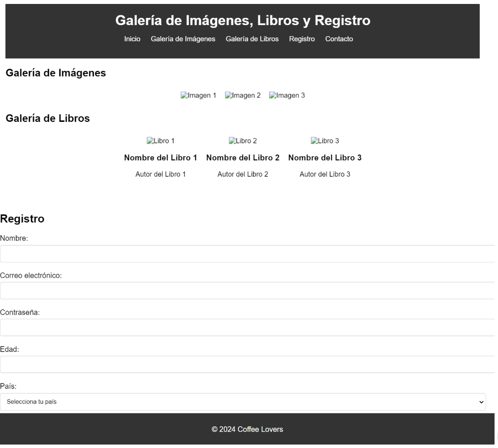

# Tarea

## Tarea práctica: Diseño de una página web con galería de imágenes, galería de libros y formulario de registro

### Instrucciones

Crea una página web que incluya una galería de imágenes, una galería de libros y un formulario de registro. La página debe cumplir con los siguientes requisitos:

**Galería de Imágenes:**

- Utiliza Flexbox para organizar las imágenes en filas.
- Configura la dirección de apilamiento para que las imágenes se muestren en filas horizontales.
- Alinea las imágenes al centro horizontalmente y al inicio verticalmente.
- Establece un margen entre las imágenes para mejorar la presentación.
- Asegúrate de que las imágenes se ajusten automáticamente al tamaño del contenedor y mantengan su relación de aspecto.

**Galería de Libros:**

- Crea una galería de libros con sus respectivas carátulas, nombres de los libros y autores.
- Utiliza Flexbox para organizar los libros en filas.
- Alinea los libros al centro horizontalmente y al inicio verticalmente.
- Establece un margen entre los libros para mejorar la presentación.
- Asegúrate de que las carátulas de los libros se ajusten automáticamente al tamaño del contenedor y mantengan su relación de aspecto.

**Formulario de Registro:**

- Crea un formulario de registro con los siguientes campos:
  - Nombre
  - Correo electrónico
  - Contraseña
  - Edad
  - País
- Estiliza el formulario utilizando CSS para que sea atractivo y fácil de usar.
- Utiliza etiquetas HTML semánticas y selectores de CSS adecuados.
- Asegúrate de que el formulario sea responsive y se vea bien en dispositivos móviles y de escritorio.

**Consideraciones adicionales:**

- Utiliza HTML semántico para estructurar tu página web.
- Experimenta con diferentes valores para las propiedades Flexbox para lograr un diseño atractivo y funcional.
- Asegúrate de probar tu página en varios dispositivos y tamaños de pantalla para garantizar su compatibilidad y usabilidad.
- Utiliza comentarios en tu código HTML y CSS para explicar la estructura y el propósito de tus elementos y reglas de estilo.

