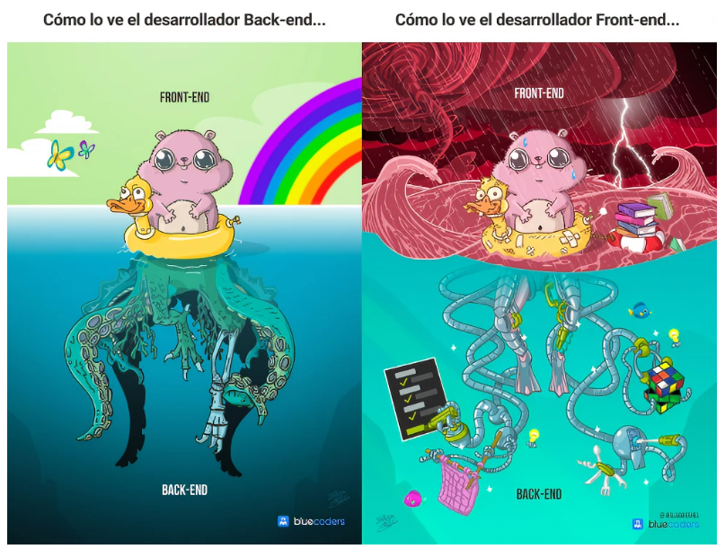
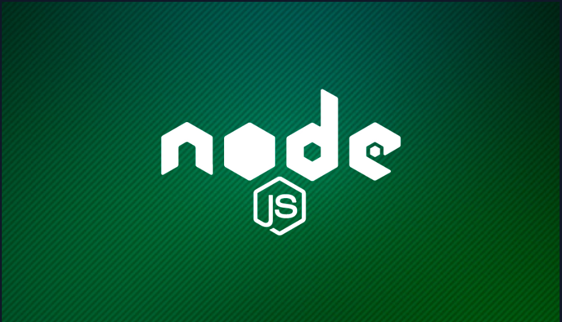
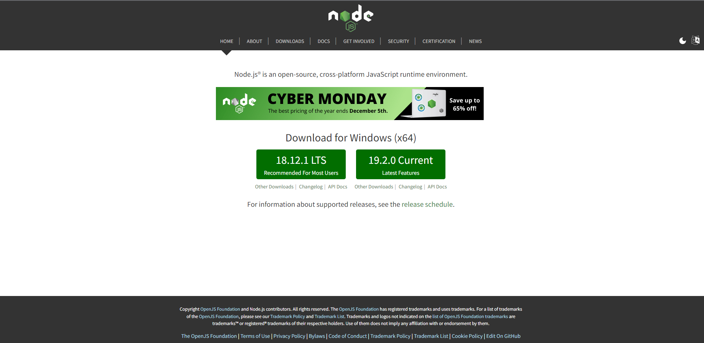
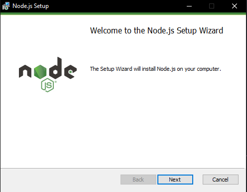
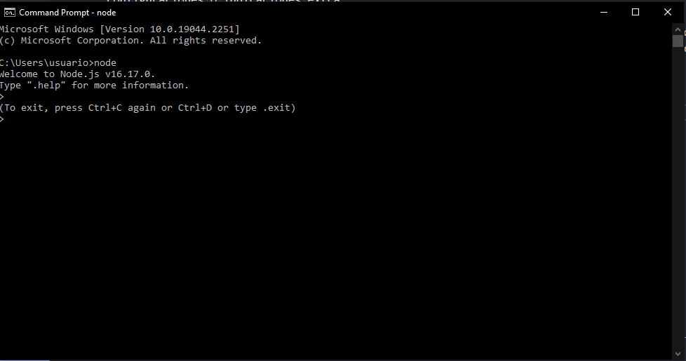
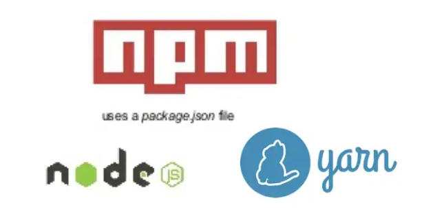
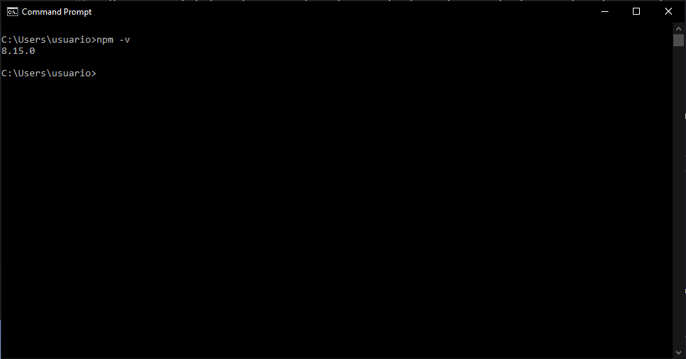

# NodeJS

Cuando hablamos de desarrollo de aplicativos pensados para ser consumidos por un usuario final sin conocimiento tecnico el desarrollo de esta aplicación se separa en dos areas, el area visual o con la que interactua el usuario que sería la interfaz gráfica cuyo propiosito principal es de verse agradable, ser usable y de presentar toda la facilidad necesaria al usuario para la interacción con este y luego tendríamos un area que se encarga de la parte lógica y de datos, de obtener los datos que requiere el usuario y de transformarlos como se necesite para la interacción con el sistema.

La primera parte que es la mas enfocada en la parte visual es la que conocemos como el Frontend, el Backend sería la parte lógica y de datos; cada una ocupa un papel fundamental en el funcionamiento de la aplicación y como veremos tienen distintos interfaces de comunicación como las API, a eso se refieren los conceptos Backend y Frontend, al area de la aplicación sobre la que se enfocan.



Como vemos, hay dos fotos que hacen referencia al mismo escenario pero interpretado de dos maneras distintas, en la interpretación del desarrollador Backend vemos el Frontend como un area agradable y tierna, caso contrario pasa para el Frontend cuya misma area percibe de manera hostil y desafiante mientras la otra la vé tierna y docil, esto habla mas de la percepción de un area de enfoque sobre la otra, por supuesto esta percepción parte de la desinformación y siempre vamos a ver como hostil y complicado algo que desconocemos. Mas allá de esta ejemplificación vista en la imagen, notamos un elemento importante y es que el oso de peluche con flotador que es el eje central de la imagen tiene todo el cuerpo por encima que representaria el Frontend como tal y las piernas bajo el agua, que las piernas vendrían siendo el Backend.

Ya con esta diferencia clara, ahora si, miremos NodeJS o Javascript para Backend.



## Qué es NodeJS?

Contrario a lo que se piensa realmente NodeJS NO es un lenguaje de programación como tal, realmente NodeJS no es mas que un entorno de ejecución de Javascript.

Como sabemos Javascript es un lenguaje de programación el cual es interpretado por los navegadores web que utilizamos para darle mas vida o funcionalidad a nuestras paginas web, entonces, anteriormente cuando hablabamos de Backend siempre teníamos que pensar en otro lenguaje para implementarlo en nuestras aplicaciones web puesto que Javascript depende de un navegador web para poder ejecutarse.

Los desarrolladores de Javascript trabajaron entonces en una versión de Javascript que no tuviera este problema, que se ejeutara por fuera de navegadores normalmente como si se tratase de una aplicación independiente, así se dió el nacimiento de NodeJS. Gracias a Node.js se puede ir un paso más allá en la programación con JavaScript no solo creando sitios web interactivos, sino teniendo la capacidad de hacer cosas que otros lenguajes de secuencia de comandos como Python pueden crear.

Entonces, NodeJS es como Javascript pero por fuera de un navegador palabras mas palabras menos, Javascript y NodeJS se ejecutan sobre el motor Javascript V8 el cual toma el código Javascript y lo convierte a lenguaje maquina, este lenguaje es interpretado de manera mas agil por las maquinas lo que tiene como resultado desarrollos eficientes en cuanto a recursos.

NodeJS utiliza un modelo de entrada y salida sin bloqueo, lo debemos recordar de cuando hablamos de la estructura de Javascript y la asincronía por diseño, esto lo hace muy llamativo en cuanto a eficiencia para manejar distintos eventos recurrentes. La idea principal de NodeJS es utilizar todas estas herramientas para hacer una gestión de gran cantidad de conexiones simultaneas con un nivel de rendimiento superior, por eso NodeJS cuando se trata de programación de procesado intensivo eliminará todas sus ventajas.

Entonces, para resumir NodeJS es un motor que trabaja sobre Javascript que nos permite crear aplicaciones con rendimientos sobresalientes y sobre todo con gran flexibilidad, que junto con NPM hace una red gigante de librerías y Frameworks que lo posicionan como una de las tecnologías mas utilizadas en todo el mundo.

## Instalando NodeJS

### Para Windows

Para instalar NodeJS bastará con ingresar al siguiente [link](https://nodejs.org/en/) el cual nos llevará a la pagina principal de NodeJS.



Aquí haremos clic en DOWNLOADS para ir a la sección de descargas, aquí encontraremos dos ventanas, una llamada `LTS` y otra llamada `Current`, la segunda contiene la versión mas reciente de NodeJS sin embargo, Node constantemente se está actualizando, pasa que solo cada cierto tiempo sacan una nueva versión `LTS`, estas se refieren a la versión mas reciente que tiene soporte completo porque si bien Node se actualiza mucho, son actualizaciones pequeñas que pueden presentar errores, por tanto se comprometen con hacerle soporte a las versiones `LTS` las cuales son versiones que los creadores definen que por su estabilidad y correcto funcionamiento es una versión que se soportará por un tiempo, por tanto, lo recomendable siempre es utilizar la versión `LTS` entonces haremos clic en la versión recomendada LTS.

Luego cuando se nos descargue el ejecutable lo ejecutaremos, nos abrirá una pantalla como la siguiente.



Aquí basicamente haremos clic en siguiente hasta haber completado la instalación, no tiene configuraciones o indicaciones extra.

Para verificar que NodeJS ha sido correctamente instalado en nuestra maquina podemos acceder a la consola de comandos y digitar el comando `node`. Si la instalación fue exitosa nos debe retornar un mensaje indicando la versión y abriendo la linea de codificación. Miremos la siguiente imagen.



Como vemos luego de la versión de NodeJS nos abre la consola de Node donde podemos codificar como lo haciamos en la consola del navegador de internet.

Finaliza la verificación, ya nuestro computador estará listo para interpretar construcciones de NodeJS.

### Para MAC

Para el caso de MAC nos vamos al apartado de descargas en la pagina de Node, podemos hacer clic [**aquí**](https://nodejs.org/en/download/) para ir a la sección, aquí encontraremos la siguiente pantalla.


Como es recomendado descargaremos el instalador para la versión LTS ultima y el mismo instalador hará el trabajo, luego en la consola podemos validar la instalación con el comando `node` igual que para la instalación de Windows.

### Para Linux

Para Linux como siempre es el caso la instalación está bastante abierta a cada quien, de esta pagina podemos descargar los binarios pero finalmente podemos utilizar cualquiera de los instaladores de las distintas distribuciones de Linux para instalarlo, una de las mas recomendadas para Ubuntu que es de los mas comunes es NVM, el gestor de versionamiento de Node con la cual seguiremos los siguientes pasos.

Para descargarlo

```
curl -o- https://raw.githubusercontent.com/nvm-sh/nvm/v0.39.1/install.sh | bash
```

Ejecutamos el script de instalación

```
bash install_nvm.sh
```

Reiniciamos la terminal

```
source ~/.bash_profile
```

Instalamos la versión LTS

```
nvm install --lts
```

Y finalmente verificamos que tenemos instalado correctamente node con el comando `node`.

## Como organizar código (Modulos)?

Una de las funcionalidades principales de NodeJS es el manejo de módulos, como lo hemos visto ya recientemente de manera muy intensa, podemos obtener módulos hasta de un repositorio de librerías y Frameworks de manera muy sencilla y así mismo Node nos permite la gestión de nuestro código mediante modulos como lo aprendimos a hacer por ejemplo con los bundlers con el Javascript de frontend, esto nos facilita mucho mejorar la legibilidad de nuestro código, miremos por ejemplo la estructura que trabajabamos en React.


Esta es una de las principales adiciones de NodeJS a nuestro repertorio y que colocan a Javascript como una opción muy llamativa para desarrollos de escritorio como podriamos hacerlos con Python o Java por ejemplo.

Así mismo nosotros podemos subir nuestros módulos a internet a repositorios de librerías y también que los demas accedan a ellos o también nosotros mismos. Cabe repasar las distintas maneras de `exportar` e `importar` módulos que vimos en módulos pasados.

## Gestores de paquetes

Este es otro tema que retomamos que ya habíamos visto anteriormente, cuando vimos la instalación de npm y npx para la creación de proyectos de React vimos el tema en bastante profundidad, retomemoslo.

Los gestores de paquetes son un concepto fundamental en no solo NodeJS sino en muchos lenguajes de programación, estos nos ayudan a acceder a librerías o frameworks desarrollados por todo tipo de empresas y personas, esto nos da acceso a soluciones de varias fuentes a un tipo de problema en particular, por tanto una porción muy grande del desafio de desarrollar software ha pasado a ser el desafio de conocer las librerías del mercado, como utilizarlas y como implementarlas con otras, por supuesto es fundamental también tener todos los conceptos fundamentales muy claros antes para no solo comprender como funcionan las librerías que utilizamos sino para saber desenvolvernos en todo tipo de necesidades mas especificas o mas generales.

Mencionamos entonces que NodeJS tiene muchos gestores de paquetes distintos, entre ellos los dos principales y en los que se resumen siempre los debates sobre el tema, son `yarn` y `npm`.

.

Recordamos entonces lo mencionado, `Yarn` es un gestor de paquetes desarrollado por Facebook en colaboración con Google el cual cada vez toma mas fuerza destaca por sus prestaciones para proyectos muy grandes y extensos que requieren de configuraciones bastante especificas o para modelos de trabajo como por ejemplo el monorepo, sin embargo pese a todas sus ventajas `yarn` tiene una curva de aprendizaje un poco mas larga la cual no lo hace tan llamativo o amigable con las personas nuevas en este mundo, esto sumandole por ejemplo la arquitectura de Micro servicios que desmaterializa nuestros proyectos gigantes en muchos mini proyectos que tienen un funcionamiento simple `npm` se hace muy llamativo para este tipo de proyectos por su simplicidad y facil implementación y como se sabe la arquitectura de microservicios ahora mismo es una de las mas fuertes o utilizadas si no es la mas utilizada entonces hace de `npm` por transitividad también el mas utilizado.

Ya en pasados módulos vimos su implementación, instalación y su comparación, retomemos con la instalación para empezar a exprimir al maximo toda su funcionalidad en módulos futuros.

## Instalación NPM

Entonces `npm` es la herramienta que utilizaremos para instalar nuestros paquetes, como lo mencionamos antes, hablando de su instalación, haciendo clic [aquí](https://docs.npmjs.com/downloading-and-installing-node-js-and-npm) obtendremos información sobre los distintos metodos de instalación que tenemos para `npm`, generalmente al instalar NodeJS tendremos instalado NPM también pero puede suceder que no, sigamos los pasos del link dado para instalarlo correctamente. Para instalar NodeJS usamos [este](https://nodejs.org/en/download/) link.

Una vez instalado podemos verificarlo ejecutando en la consola de comandos el siguiente comando.

```cmd
npm -v
```

La respuesta esperada del primer comando es la versión de `npm` instalada en el sistem. Una vez tengamos respuesta estaremos listos para iniciar.



## Final del módulo

Llegamos al final del módulo intructorio de NodeJS, dejamos instaladas las dos herramientas fundamentales en el desarrollo con NodeJS y estamos listos conceptualmente y en cuanto a instalaciones para empezar con implementaciones de NodeJS en el Backend, pasemos entonces a los siguientes módulos avanzados de desarrollo con Javascript, el mundo del `Backend`.
