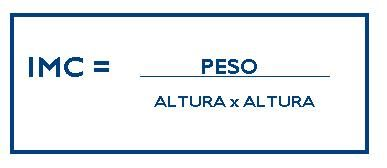

# Tareas del módulo

Las tareas de los módulos son pensadas para profundizar en los temas expuestos e interiorizar más el conocimiento. 

## Tareas

- Crea un programa usando javascript que calcule el indice de masa corporal de una persona, para ello debes hacer lo siguiente:

    - Tu programa debe pedir que el usuario escriba su nombre completo y almacenarlo en una variable.
    - Luego, se debe solicitar al usuario escribir la altura en centimetros, esta altura debes almacenarla en otra variable y posteriormente convertirla de centimeros a metros.
    - Como ultimo parametro debemos pedir al usuario su peso en kilogramos, ten presente que debes permitir al usuario inmgresar valores enteros y decimales, ejemplo, 60 o 59.7
    - Tu programa debe calcular el indice de masa corporal y como resultado se debe mostrar en pantalla el siguiente mensaje: 
    
    ```
    Hola NOMBRE_PACIENTE, tu indice de masa corporal es XX.X kg/m2
    ````

    Recuerda que para calcular el indice de masa corporal de una persona (IMC) puedes usar la siguiente formula `imc = peso / (altura x altura)`:

     

