# Diagramas de flujos

Hemos repasado bastante temas fundamentales en el desarrollo de software concretamente en el scripting con Javascript, hemos repasado las bases, conceptos bastante avanzados y ahora tenemos toda la capacidad teorica para empezar a ver implementaciones de nivel profesional de Javascript, sin embargo, antes de ello, en este modulo vamos a mirar un tema que nos va a ayudar precisamente a llevar todo ese conocimiento a un ambito profesional, pues de nada nos sirve ser expertos en desarrollo de software si no tenemos claro una necesidad o problema a resolver. El 80% del trabajo como desarrolladores consiste en entender nuestro problema al punto de comprender el algoritmo que nos llevará a la solución para finalmente si pasar a implementarlo. Miremos entonces, un lenguaje universal a la hora de representar problemas y de entenderlos de manera que podamos luego pasar a desarrollar soluciones, los `diagramas de flujos`

## Qué es un diagrama de flujo?

Veamos un poco de historia antes de empezar de lleno con la teoria.

### Historia

La utilización de diagramas de flujo data de inicios de 1920, en esa decada que comprendió hasta 1930 los ingenieros Frank y Lillian Gilbreth presentaron el `diagrama de flujo de procesos` en la Sociedad Americana de Ingenieros Mecanicos (ASME). A principios de 1930 otros ingenieros emplearon esta misma metodología para exponer conferencias sobre como mejorar la eficiencia del trabajo en el area de negocios, luego en 1940 dos estudiantes de Morgensen difundieron los metodos expuestos anteriormente de manera mas amplia que luego en 1947 fue adoptada por ASME sociedad la cual estableció simbolos y planteó el primer estandar para el desarrollo de diagramas de flujo.

Ahora si pasemos a la teoría, iniciemos mirando la definición por concepto de diagramas de flujo

### Qué es?

Un diagrama de flujo es un diagrama que describe un proceso, sistema o algoritmo informático. Se usan ampliamente en numerosos campos para documentar, estudiar, planificar, mejorar y comunicar procesos que suelen ser complejos en diagramas claros y fáciles de comprender. Es decir, el fin de los diagramas de flujo es exponer de una manera mucho mas entendible y resumida el funcionamiento de procesos de sistemas, en este se ilustran desde las entradas hasta todo tipo de procesamientos que se le dan a estos insumos y se llega hasta la salida. Mediante el uso de las herramientas que dispone a nosotros podemos llegar a gran detalle sobre los procesos descritos en estos diagramas.

Los diagramas de flujo emplean rectángulos, óvalos, diamantes y otras numerosas figuras para definir el tipo de paso, junto con flechas conectoras que establecen el flujo y la secuencia. Pueden variar desde diagramas simples y dibujados a mano hasta diagramas exhaustivos creados por computadora que describen múltiples pasos y rutas.

Entonces como lo miraremos en siguientes secciones de este modulo según la forma de los simbolos utilizados en los diagramas de flujo se describen distintos procesos, flujos o relaciones entre estos mismos.

Si tomamos en cuenta todas las diversas figuras de los diagramas de flujo, son uno de los diagramas más comunes del mundo, usados por personas con y sin conocimiento técnico en una variedad de campos.

De hecho se considera en si diagrama de flujo hasta la expresión mas basica que hacemos cuando con nuestro amigos queremos ejemplificar graficamente los pasos que vamos a seguir para jugar un juego como pueden ser las cogidas o escondites.

Los diagramas de flujo a veces se denominan con nombres más especializados, como "diagrama de flujo de procesos", "mapa de procesos", "diagrama de flujo funcional", "mapa de procesos de negocios", "notación y modelado de procesos de negocio (BPMN)" o "diagrama de flujo de procesos (PFD)" pero finalmente todos se refieren a un mismo concepto, por lo que podemos deducir que en realidad acotar el concepto de `diagrama de flujo` a una serie de reglas o simbolos estrictos puede resultar hasta ilogico, los simbolos o notaciones se adoptan según necesidad y si bien el concepto hace referencia a una practica, pensar en estandarizarla puede quitarle muchas posibilidades mas de darle, por supuesto existen buenas practicas pero las adaptaciones del concepto son infinitas.

Están relacionados con otros diagramas populares, como los diagramas de flujo de datos (DFD) y los diagramas de actividad de lenguaje unificado de modelado (UML) que finalmente vienen siendo tipos de modelado grafico de soluciones.

Miremos un ejemplo de un diagrama de flujo para empezar.

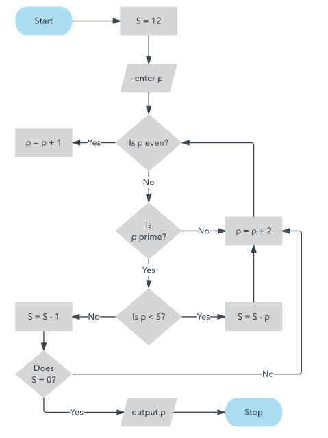

Aquí ya empezamos a evidenciar elementos en común como podría ser por ejemplo que cuando se presentan condicionales se representan con rombo, o que la inicial y final son con puntas redondeadas. Mas adelante profundizaremos mas en estos temas.

Pasemos ahora entonces a mirar los elementos que componen los diagramas de flujo.

### Simbolos de diagrama

- `Inicio y Fin` Es el simbolo el cual representa el punto de inicio, punto de fin y los posibles resultados de un camino. A menudo contiene palabras como `inicio` o `fin`
  - 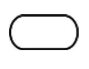
- `Proceso` Es el simbolo el cual representa una acción en el sistema, es el simbolo mas apliamente utilizado y se usa para en general denotar una cierta acción.
  - 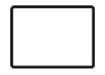
- `Documento` Es un simbolo utilizado para denotar una entrada o salida de un documento, por ejemplo, cuando se utiliza para entradas se refiere a recepciones de correos electronicos o de informes, para el caso de salidas se refiere a por ejemplo generar una presentación, un memo o una carta
  - 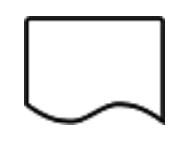
- `Decision` Indica una pregunta que debe responderse, por lo general se utiliza mucho para operaciones booleanas como podría ser operaciones que como resultado dan verdadero o falso, estas son las que controlan los cambios de flujo de nuestros diagramas, pueden generar varias ramas según la respuesta de la decisión.
  - 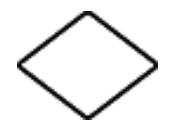
- `Conector` Se utiliza en diagramas bastante complejos y extensos, se utiliza para conectar elementos separados por paginas para facilitar su correcta visualización.
  - 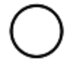
- `Enlace` Se utiliza también en diagramas complejos y extensos, en este caso dentro del simbolo se coloca un simbolo referencia a la sección a la que hace enlace como por ejemplo el número de pagina o cualquier simbolo utilizado
  - 
- `EntradaSalida` Se le conoce como el simbolo de datos, representa datos que están disponibles como entrada o salida y también representa recursos empleados o generados.
  - 
- `Comentario` Este simbolo empleado junto con contexto agrega explicación o comentarios en un rango especifico con miras a aclarar procesos que quiza graficamente no se logren explicar bien o para simplemente exponer consideraciones importantes. También puede ser utilizada conectada mediante una linea discontinua al diagrama de flujo.
  - 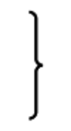

Estos son los simbolos principales, existen muchos mas como por ejemplo

- `Bases de Datos` Representa datos alojados en un servicio de almacenamiento que probablemente permitirán busqueda y filtrado con fines de implementación en procesos del diagrama
  - 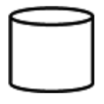
- `Union` Se utiliza para representar la suma de entradas de varias rutas que convergen
  - 
- `Proceso Predefinido` Se usa para representar un proceso u operación complicado que es bien conocido o se define en otro documento
  - 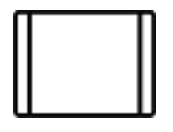

Como vemos estos ultimos tienen usos algo especificos que resultarán poco comunes, los diagramas de flujos en sus estandares cuentan con infinidad de simbolos como estos, ya vimos los principales pero por supuesto dependiendo de la herramienta para graficado hasta varían por tanto se hace interesante investigar cada herramienta, claro que la gran mayoría de diagramas se pueden realizar y resultan mas claros representados con los simbolos fundamentales ya vistos.

### Diagramas de flujo en algoritmos informaticos (desarrollo de software)

Como una representación visual del flujo de datos, los diagramas de flujo son útiles para escribir un programa o `algoritmo` y explicárselo a otros o colaborar con otros en el mismo, es decir, para hacer entender mejor el problema.

Puedes usar un diagrama de flujo para explicar detalladamente la lógica detrás de un programa antes de empezar a codificar el proceso automatizado, luego este paso comprendería lo que hemos trabajado como el entendimiento de la solución.

Puede ayudar a organizar una perspectiva general y ofrecer una guía cuando llega el momento de codificar. Más específicamente, los diagramas de flujo pueden:

- Demostrar cómo el código está organizado.
- Visualizar la ejecución de un código dentro de un programa.
- Mostrar la estructura de un sitio web o aplicación.
- Comprender cómo los usuarios navegan por un sitio web o programa.

A menudo, los programadores pueden escribir un pseudocódigo, una combinación de lenguaje natural y lenguaje informático que puede ser leído por personas. Esto puede permitir más detalle que el diagrama de flujo y servir como reemplazo del diagrama de flujo o como el próximo paso del código mismo.

Los diagramas relacionados que se emplean en el software informático incluyen por ejemplo el lenguaje unificado de modelado (UML), este es el lenguaje de propósito general usado en la ingeniería de software para el modelado de distintos sistemas como base de datos o clases.

### Casos de uso de diagramas de flujo

Los casos de uso de diagramas de flujo son infinitos, desde la educación para crear una presentación oral o un plan de clase, planificar requisitos academicos o describir graficamente un plan de un curso, por otro lado para procesos en industrias por ejemplo pueden ayudarnos a entender pasos de una industria lo que llevaría al equipo a plantear soluciones para optimizar procesos, entre otros.

Ahora miremos algunos ejemplos para entrar en calor.

## Ejemplos

Ya habiendo visto la teoria miremos ahora algunos ejemplos, por supuesto empezaremos con ejemplos muy basicos e iremos profundizando a ejemplos mucho mas complejos con casos de la vida real.

Miremos un ejemplo basico donde literalmente planteamos un algoritmo de cocina para cocinar un huevo.

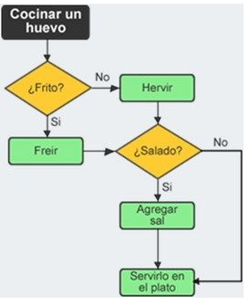

Como vemos en este diagrama se utilizan solamente 3 elementos de los vistos para componer diagramas, el de `InicioFin` por supuesto para indicar el inicio del flujo, luego el de `proceso` para definir los distintos procesos que comprenden nuestro flujo y el de `decisión` para controlar el flujo de nuestro diagrama, iniciamos con una decisión donde preguntamos si el huevo se desea frito, si es así entonces se pasa al proceso `freir`, caso contrario entonces pasamos al proceso de `hervir`, luego de elegir como lo queremos preparar, luego llegamos a una nueva decisión, `salado?` en la cual nuestro flujo se separa en dos, uno para cuando el huevo se desea salado para el cual debemos agregar sal y otro para cuando no que entonces pasamos al proceso final `Servir en el plato`.

Como vemos los diagramas de flujo nos sirven para ejemplificar casos hasta de la vida real con lujo de detalles de manera que no haya lugar a errores. Miremos un ejemplo un poco mas complejo.

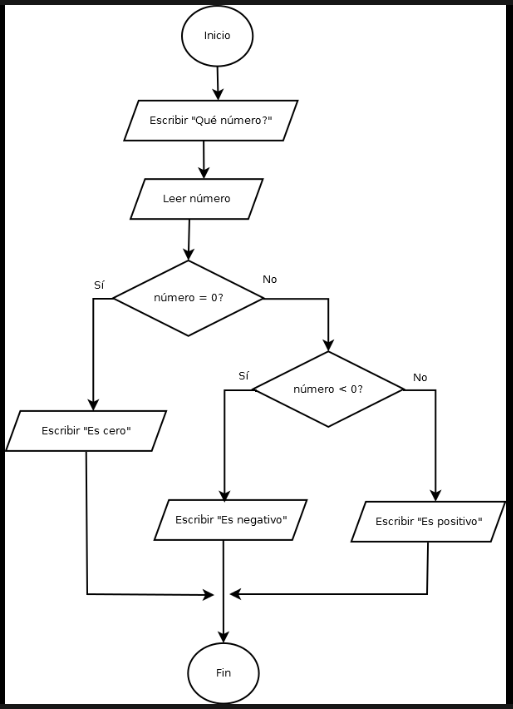

En este caso vemos que no se emplean simbolos de `proceso`, en su lugar se reemplazan por `EntradaSalida` los cuales sin ningún tipo de problemas podrían ser reemplazados por simbolos de `proceso` pues para el caso son procesos parecidos, aquí se ejemplifica lo abiertos a la manera de pensar el grafico de cada creador que son los diagramas de flujo. Por otro lado, notamos que este ejemplo si se refiere como tal a un algoritmo propiamente para un código que se desea desarrollar, cuenta con condicionales booleanos y en general está escrito en un lenguaje de `pseudocodigo`.

> El `pseudocodigo` es un concepto el cual hace referencia a un lenguaje que no llega a ser tecnico pero utiliza conceptos tecnicos de la programación, es en otras palabras programar en lenguaje humano, es utilizado para ejemplificar desarrollos y sumamente empleado en diagramas de flujo como el presente.

En este caso observamos que el fin de nuestro diagrama de flujo es indicar si un número ingresado por el usuario es positivo o negativo y tiene un flujo adicional para que si el usuario ingresa `cero` entonces se le indica pues este no tiene ningún signo definido por lo que es una consideración importante incluir este flujo.

Veamos otro ejemplo.

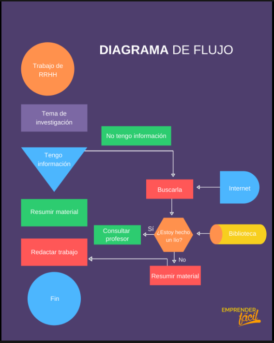

En este caso tenemos un diagrama enfocado a que se tiene un trabajo el cual requiere del conocimiento de un tema de investigación, en un inicio todo el flujo se separa en una decisión la cual resulta de si tenemos información sobre el tema de investigación o no.

Si se tiene información se pasa directamente a resumirla y redactar el trabajo, sin embargo si no se tiene la información pasamos a un flujo bastante mas complejo con condicionales propios y con varios simbolos que no habíamos visto en diagramas anteriores como el de entradas externas o de base de datos e incluso vemos un condicional que tiene varias salidas y entradas, por tanto toma esta forma de hexagono, como bien lo hablamos esto no es una regla definida, pero es perfectamente entendible y definido por el contexto que nos brinda el diagrama.

Este es un ejemplo bastante claro que nos ilustra la amplia gama de posibilidades que nos abren los simbolos de los diagramas de flujo y sus distintas combinaciones.

Miremos un ultimo diagrama compuesto.

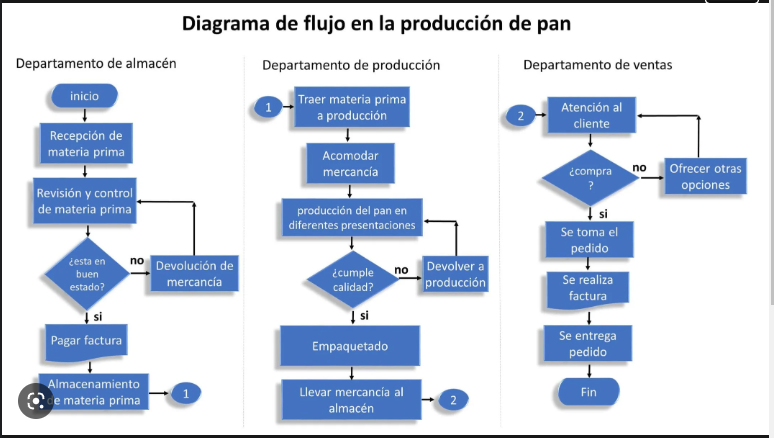

Como vemos en este caso tenemos un diagrama del flujo de producción de pan, en este caso el proceso involucra tres departamentos distintos cuyos procesos dependen uno de otro, de esta manera denotamos la conexión entre ellos con conectores que nuevamente, utilizan simbolos distintos a los vistos en la teoria.

De esta manera generamos un flujo compuesto que por si solo si lo intentaramos ilustrar en uno solo podría resultar bastante confuso por los distintos elementos y procesos de distintos departamentos que contiene, sin embargo, con el conocimiento de las herramientas que tenemos a la mano para el desarrollo de estos se genera uno compuesto por 3 sub diagramas que resulta muy facil de leer y por tanto de entender.

## Final del módulo

Como vimos durante este modulo los diagramas de flujo hacen referencia a un concepto tan amplio como nuestra imaginación, por tanto si bien es fundamental tener bases claras y una fundamentación teorica base en este tema, al final resulta siendo bastante libre su interpretación y se resulta con mucha libertad a la hora de graficar, al final lo único en lo que se resume si lo hicimos de manera correcta o no es si el diagrama resulta entendible para nuestro equipo de trabajo y por supuesto para nosotros mismos. Ahora si, finalizando conceptos fundamentales estamos listos para dar cierre a este `Módulo 1 de fundamentos de JS` y del desarrollo de software y estamos listos para iniciar el `Módulo 2 de Desarrollo Frontend`.
