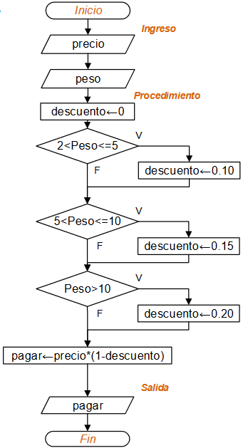

# Tarea: Diagramas de flujo

Como tarea te proponemos crear algunos diagramas de flujo dados los siguientes problemas

## 1. Calcular el area de un triangulo
Calcular el área de un triángulo.

### Pasos a seguir:
 
- Solicitar al usuario que ingrese la base del triángulo.
- Solicitar al usuario que ingrese la altura del triángulo.
- Calcular el área del triángulo utilizando la fórmula: área = (base * altura) / 2.
- Mostrar el resultado al usuario.

Despues de tener el diagrama de flujo, crea un programa en JS para calcular el area de un triangulo

### 2. Programa para calcular descuentos

Crear un programa usado Javascript que determine si un número ingresado por el usuario es primo o no.

Una frutería ofrece las manzanas con descuento según la siguiente tabla:

| kilos comprados | Descuento % |
|----------|----------|
| 0 – 2    | 0%   |
| 2.01 – 5    | 10%   |
| 5.01 – 10    | 15 %   |
| 10.01 en adelante    | 20%  |

Dado el precio por kilo, y el peso, Crear un programa usado Javascript que determine cuánto pagará una persona que compre manzanas es esa frutería.

A continuación te presentamos un diagrama de flujo que te puede ayudar a entender mejor el problema

## 3. Creación de Diagrama de Flujo de un Proceso Laboral:

Representar visualmente un proceso específico relacionado con el trabajo de cada estudiante utilizando un diagrama de flujo.

### Pasos a seguir:

- Identificación del Proceso:

  Cada estudiante deberá seleccionar un proceso específico que se desarrolle en su trabajo o en un proyecto en el que estén involucrados.

  El proceso puede ser cualquier tarea, procedimiento o flujo de trabajo que sea relevante para su área de trabajo o estudio.

- Análisis del Proceso:

  Antes de comenzar a crear el diagrama de flujo, los estudiantes deberán analizar detalladamente el proceso seleccionado.

  Deberán identificar los pasos individuales, las decisiones tomadas en cada paso y cualquier otro elemento importante del proceso.

- Creación del Diagrama de Flujo:

  Utilizando un software de dibujo o una herramienta en línea especializada en la creación de diagramas de flujo (como Lucidchart, Draw.io, etc.), cada estudiante deberá crear un diagrama de flujo que represente el proceso identificado.

  Deberán utilizar símbolos estándar de diagramas de flujo para representar los pasos, decisiones, inicio y fin del proceso, entre otros elementos.

  Asegúrate de que el diagrama de flujo sea claro y fácil de entender, incluso para alguien que no esté familiarizado con el proceso.

- Revisión y Edición:
  Después de crear el diagrama de flujo inicial, los estudiantes deberán revisarlo cuidadosamente para detectar posibles errores o áreas de mejora.
  Deberán realizar las ediciones necesarias para mejorar la claridad y precisión del diagrama.

