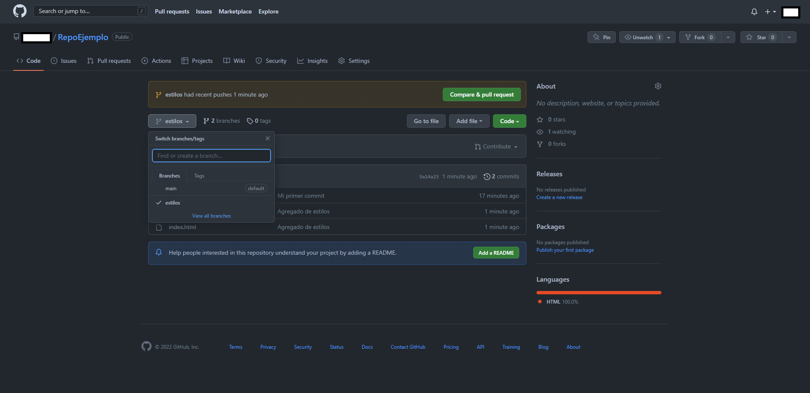
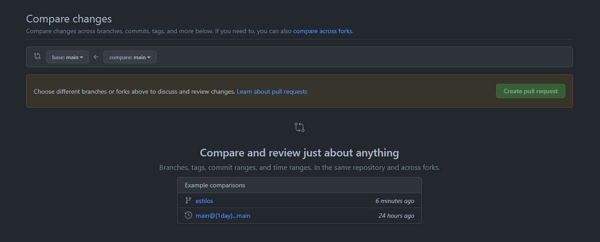
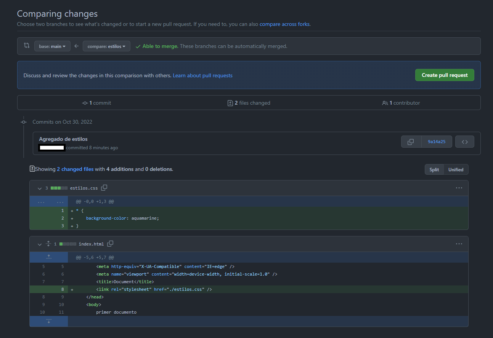
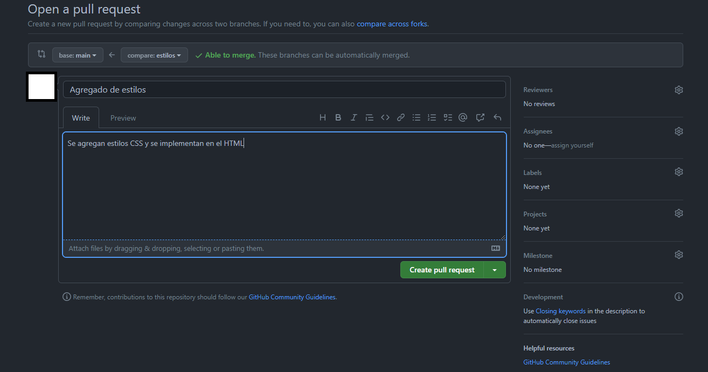
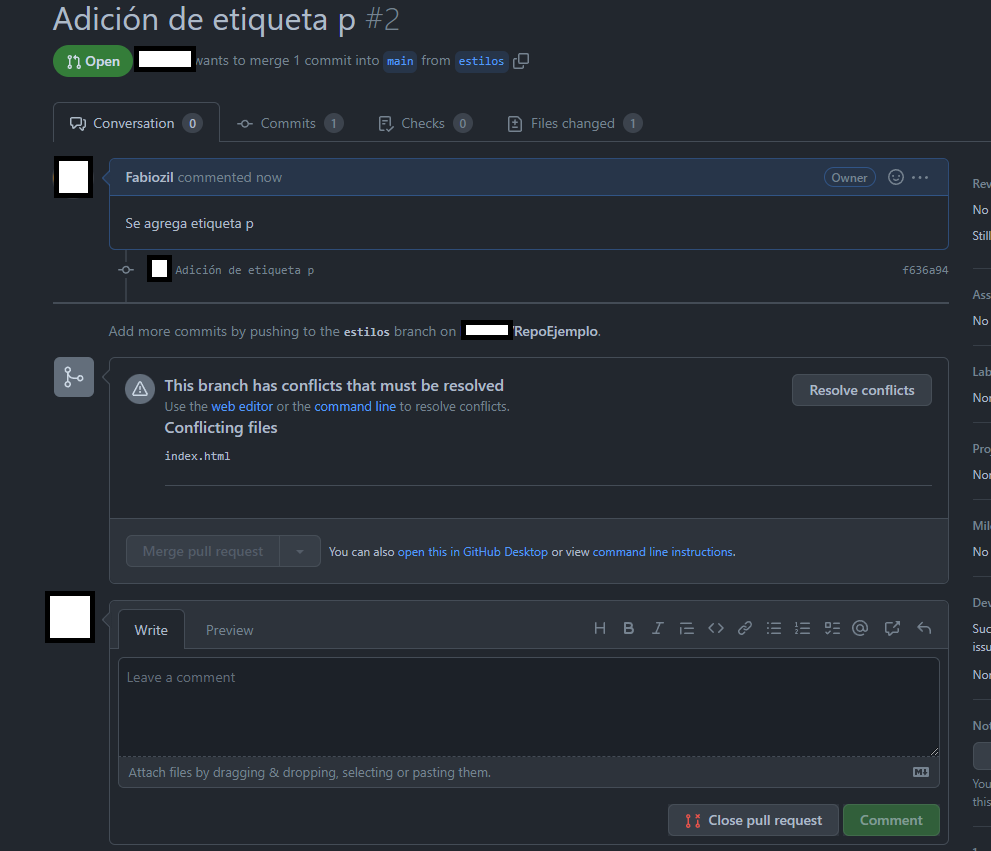
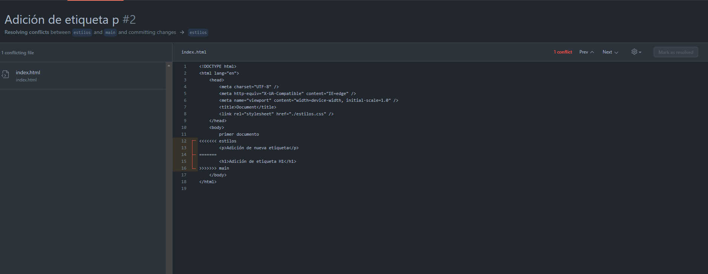

# Manejo de versiones

El manejo de versiones en el desarrollo de software es una de las habilidades que como desarrolladores debemos tener muy bien desarrollada y comprender todos sus elementos a la perfección, ya sea porque estamos trabajando en algún proyecto propio nuestro para estudiar o estamos desarrollando algún tipo de emprendimiento, el manejo de versiones es un tema fundamental en el desarrollo de cualquier proyecto por grande o pequeño que sea.

En el mundo profesional en absolutamente todos los proyectos se utilizan herramientas de control de versiones, esto por las prestaciones que nos da tener nuestro código en un repositorio, como pueden ser el tener un historial de versiones, tener muchas ramas distintas o versiones distintas de un mismo código, el trabajo en equipo sobre un mismo código que está actualizando en tiempo real, ahorros de tiempo en implementaciones de cambios en el código, seguridad porque nos da la posibilidad de revertir cambios que hayan podido generar errores y seguridad porque sabemos que nuestro código siempre estará persistido en internet y tendremos la posibilidad de recuperarlo cada que necesitemos. Por todos estos temas las herramientas de control de versiones son simplemente obligatorias en todos los proyectos de desarrollo de software.

Seguramente a este punto del curso ya hemos escuchado hablar mucho sobre git, github, gitkraken y demás, seguramente ya nos hacemos una idea de para qué sirven este tipo de herramientas, pero seguramente también tendremos muchas dudas, entonces, mirémoslo a detalle.

En el desarrollo de software tenemos proyectos donde muy rara vez trabaja una sola persona, aparte de esto, un software siempre requiere de mantenimiento, este mantenimiento casi nunca se lo da una misma persona hasta que el software se deja de utilizar, por esto se hace fundamental el tener nuestro código en algún repositorio donde el que requiera claramente teniendo en cuenta temas de seguridad y confidencialidad pueda acceder al código para ya sea modificarlo o simplemente visualizarlo, así mismo, también el software es demasiado cambiante, por lo que constantemente estamos ejecutando cambios sobre el y no solo una sino usualmente dos o mas personas trabajan sobre el mismo código. Ya empezamos a ver por qué se hace fundamental el versionamiento de código, que nos permita resolver conflictos, volver a versiones pasadas del código y acceder al código de manera agil y en cualquier momento.

Muchas son las herramientas que existen para este tipo de servicio, en general todas cubren las funcionalidades basicas, ya de cada una depende el enfoque que le de su empresa desarrolladora para implementar otras funcionalidades extras que le den valor agregado a la herramienta. En este caso a ver una de las mas utilizadas a nivel mundial, `Git`, vamos a mirar que es Git, como lo podemos utilizar y por supuesto su implementación.

## Qué es Git?

Git es uno de los sistemas de control de versiones mas populares a nivel mundial, fue creado en el 2005 y desde entonces ha tenido gran parte del mercado de este ambito, es utilizado para trazabilidad de código, colaboración con el código y versionamiento y control de flujo de código en general.

Nos sirve para manejar proyectos mediante repositorios, clonar proyectos para tener una copia local, seguir los cambios que se hacen en nuestro directorio local y así mismo gestionar y subir cambios al repositorio web, generar ramas para tener distintas versiones de un mismo código, luego estas ramas las podemos fusionar para implementar funcionalidades de unas a otras, tomar cambios del código en la nube, subir cambios a la nube, etc.

Trabajar con git directamente no suele ser tan amigable para el usuario, tengamos en cuenta que cuando hablamos de Git nos referimos al sistema de gestión de versiones de código como tal, luego, hay servicios como Github que lo que nos ofrecen es como su nombre lo indica, una interfaz o un portal donde podemos acceder a nuestra cuenta y tener una gestión mucho mas visual, organizada e intuitiva de todo nuestro versionamiento de código, es muy fácil confundir git con github, de hecho muchas personas creen que es lo mismo pero no, realmente es Github quien implementa las herramientas de Git y nos presta el servicio de una manera mucho más amigable, hoy en día se manejan ambas bastante juntas como un paquete. Miremos como instalamos Github y Git en nuestras maquinas para empezar en este mundo de la gestión de código.

## Instalación de Git

### Windows

Lo primero es acceder a la pagina de descargas de Git, puedes hacerlo haciendo clic [**aquí**](https://git-scm.com/downloads), en este sitio encontraremos el link de descarga para cada los sistemas operativos mas usados, haremos clic en el nuestro y seleccionando el instalador, en mi caso windows 64 bits setup se iniciará automaticamente la descarga.

Una vez descargado el instalador, lo ejecutaremos, nos debe abrir un instalador como el siguiente.


En esta pantalla haremos clic en siguiente sin modificar ninguna de las opciones hasta que lleguemos a la opción instalar, aquí le daremos clic y esperaremos a que finalice el proceso de instalación. Una vez finalice la ejecución de la instalación haremos clic en finalizar y listo, tendremos git instalado en nuestra maquina.

Una vez instalado Git, en el buscador de aplicaciones de nuestro sistema operativo buscaremos una aplicación llamada Git Bash, esta aplicación es la consola de Git que ya tendremos instalada en nuestra maquina para empezar a trabajar con Git. Debería lucir algo así.


Ejecutemos el comando `git` simplemente copiandolo y pulsando enter, deberíamos tener una respuesta como la siguiente.


Este mismo comando debemos verificar en la consola local de nuestro sistema operativo que tenga respuesta correcta, que se reconozca el comando. Si es así, confirmamos que nuestra instalación fue exitosa y podemos continuar.

### Linux

Si quieres instalar Git en Linux a través de un instalador binario, en general puedes hacerlo mediante la herramienta básica de administración de paquetes que trae tu distribución. Si estás en Fedora por ejemplo, puedes usar yum:

```
$ yum install git
```

Si estás en una distribución basada en Debian como Ubuntu, puedes usar apt-get:

```
 $ apt-get install git
```

Para opciones adicionales, la página web de Git tiene instrucciones de instalación en diferentes tipos de Unix. Puedes encontrar esta información en [http://git-scm.com/download/linux](http://git-scm.com/download/linux).

### Mac os

Hay varias maneras de instalar Git en un Mac. Probablemente la más sencilla es instalando las herramientas Xcode de Línea de Comandos. En Mavericks (10.9 o superior) puedes hacer esto desde el Terminal si intentas ejecutar _git_ por primera vez. Si no lo tienes instalado, te preguntará si deseas instalarlo.

Si deseas una versión más actualizada, puedes hacerlo a partir de un instalador binario. Un instalador de Git para OSX es mantenido en la página web de Git. Lo puedes descargar en [http://git-scm.com/download/mac](http://git-scm.com/download/mac).

Ahora miremos como utilizar Github, esta herramienta que implementa Git para versionamiento de código, ingresemos a la pagina de Github haciendo clic [**aquí**](https://github.com/).

Una vez en la pagina nos podemos crear una nueva cuenta ingresando nuestro correo electrónico y haciendo clic en Sign up for GitHub.

Una vez completamos el proceso de registro ya tendremos una cuenta de GitHub, ahora vamos a asociar esta cuenta de GitHub a nuestra consola de git en nuestra maquina para conectar así nuestra cuenta y podes gestionar nuestros repositorios de código desde GitHub.

Primero configuraremos nuestro nombre de usuario de Git, ejecutando el siguiente comando

```
git config --global user.name "Mona Lisa"
```

En este ejemplo nuestro nombre de usuario es Mona Lisa, por supuesto reemplazaremos aquí nuestro nombre de usuario deseado, para verificar si quedó bien configurado ahora ejecutaremos el comando sin el argumento del nombre de usuario, este debe retornarnos nuestro nombre de usuario

```
git config --global user.name
```

Luego tendremos que asociar nuestro correo electrónico para que nuestros commits que mas adelante veremos que son queden asociados a nuestro correo, esta configuración se hace con el siguiente comando

```
git config --global user.email "TU_CORREO"
```

Verificamos que el correo quedó bien configurado haciendo uso del siguiente comando

```
git config --global user.email
```

Debe retornarnos el correo ingresado anteriormente. La idea es que este correo sea el mismo con el que creamos la cuenta de GitHub para que queden asociados a la cuenta.

Finalmente tendremos que autenticarnos a Github desde Git, para esto bastará con intentar clonar un repositorio, GitHub nos abrirá una pagina web donde ingresaremos nuestro usuario y contraseña y quedaremos logeados para siempre en esa maquina.

## Usando GitHub

Empecemos ahora si con Github, empecemos por crea un nuevo repositorio, repasemos entonces que es un repositorio.

`Repositorio` es como se le llama al elemento fundamental de Git, es donde se aloca un proyecto, ya miraremos mas elementos de los repositorios pero por ahora vamos a crear uno.

Para crear un nuevo repositorio nos vamos a la pagina de GitHub y haremos clic en cualquiera de los botones que dicen crear un nuevo repositorio. Esto nos llevará a una pagina parecida a la siguiente.


En esta pantalla es donde digitaremos toda la información inicial de nuestro repositorio, vamos a mirar elemento por elemento para ver la información necesaria.

- `Nombre del repositorio` El nombre del repositorio es por supuesto el identificador de nuestro repositorio, puede ser cualquier aunque es buena practica ponerle un nombre alusivo al proyecto.
- `Descripción` Este campo es pura información descriptiva de nuestro proyecto, para que tanto nosotros mas adelante como otras personas puedan ver una descripción sobre de que trata el proyecto
- Luego podremos indicarle a GitHub si este proyecto va a ser privado, es decir, que solo lo podremos visualizar nosotros mismos o si es publico y de visualización libre.
- Luego podremos escoger si queremos agregar un archivo README que es una excelente practica, este archivo funciona a manera de resumen de nuestro repositorio y por ejemplo si tenemos algún tipo de proyecto que requiere de instrucciones de despliegue en local, es una excelente idea proveer este tipo de información a los usuarios de nuestro código aquí.
- Luego está el `.gitignore`, por ahora lo dejaremos en none pues no entendemos que es pero luego lo trataremos
- Finalmente tenemos la licencia, aquí podremos indicar si nuestro proyecto cuenta con algún tipo de licencia de derechos de autor pero si no es el caso podemos dejarlo en None.

Perfecto, si hemos digitado al menos el nombre de nuestro repo que es el único campo obligatorio podremos acceder a la creación, una vez creado nos llevará a la pantalla inicial del repositorio. Esta deberá lucir algo así.


Aquí tendremos una información de inicio, lo que mas nos interesa es la parte donde dice Quick setup, copiaremos el link que nos dan y ahora si entraremos de lleno a mirar conceptos de Git, con este link podremos clonar el repositorio y tener una versión local de este.

Nos iremos a la consola bash y nos ubicaremos en la ruta deseada para copiar nuestro proyecto usando el comando cd {ruta deseada} y ejecutaremos el siguiente comando

```
$ git clone {URL}
```

Al clonarlo veremos que tendremos una carpeta con el contenido de nuestro proyecto en la ruta deseada, esta carpeta ya vendrá configurada para trabajar con nuestro repositorio. Vamos a hacer nuestro primer commit.

Creemos un nuevo archivo llamado `index.html` y pongamos en un HTML sencillo, solo por la prueba.

Ahora en la ruta de nuestra carpeta ejecutemos el siguiente comando.

```
git status
```

Nos responderá un mensaje como el siguiente.

```
$ git status
On branch main

No commits yet

Untracked files:
  (use "git add <file>..." to include in what will be committed)
        index.html
```

Miremos entonces un par de conceptos para entender lo que acaba de suceder. Arranquemos mirando esta imagen


La siguiente imagen describe el flujo de trabajo basico de Git separado en tres areas distintas.

### Working directory

Cuando trabajamos en nuestra versión local de nuestro código cuando clonamos un repositorio, todo el tiempo estamos trabajando en nuestro working directory, aquí los cambios que hagamos no se van a ver reflejados en el repositorio y no tendremos modificaciones en el tampoco. Luego, si queremos subir nuestros cambios a nuestro repositorio, debemos pasarlos primero al `staging area`. Miremos los comandos mas utilizados en este area.

- `git status` Este comando nos indica el estado actual de nuestro trabajo en local, cuales archivos estamos siguiendo y cuales hemos modificado. Nos da información general sobre nuestro status
- `git add {param}` Este comando nos sirve para pasar cambios al staging area, lo utilizaremos con un parametro, este puede ser la ruta relativa de un archivo o si queremos agregar todos los cambios lo utilizaremos con un punto. Ej: `git add .`, de esta manera pasaremos cambios a nuestro staging area.

### Staging Area

La staging area es un area en la cual por así decirlo preparamos nuestros cambios para subirlos, aquí podemos visualizar los cambios que hemos realizado, elegir que cambios queremos subir, cuales queremos ignorar y entonces subir nuestros cambios, miremos los comandos mas utilizados cuando nuestros cambios ya están en este area.

- `git reset` Este comando lo utilizaremos para bajar todos los cambios de nuestro staging area, vacea por completo el staging area y deberemos indicar que archivos queremos subir nuevamente.
- `git rm {param}` Este comando recibe como argumento una ruta de un archivo, este nos sirve para bajar del staging area un archivo en particular.
- `git commit` Este comando es uno de los principales, nos sirve para una vez tenemos en el staging area cambios que queremos subir a nuestro repositorio, lo utilizaremos y se generara un nuevo commit, los `commit` son puntos donde cambia nuestro código, estos nos sirven como puntos de retorno si se requiere en un futuro, es importante colocarle un mensaje a nuestro commit para identificar que se hizo de cambios en el commit para trazabilidad, este se agrega con la opción -m en el comando de la siguiente manera `git commit -m "Se realizan x cambios"`

Luego cuando ya tenemos nuestros commit es buena idea subir los cambios a nuestro repositorio remoto de GitHub, que es finalmente donde se conectan nuestros compañeros de equipo o nosotros mismos desde otra maquina. Para comunicarnos con el repositorio remoto tendremos que agregarlo primero, si clonamos el repositorio este vendrá configurado por defecto con el nombre `origin` si no, debemos agregarlo de la siguiente manera, usando el siguiente comando.

```
git remote add {repoName} {repoURL}
```

De esta manera asociaremos a nuestro repositorio una versión remota.

Una vez ya tenemos esta versión remota configurada podemos subir los cambios haciendo uso del comando `git push`. Volvamos a nuestro ejercicio.

Supongamos que para nuestro código necesitamos un archivo con claves secretas, creemos un archivo llamado secrets.txt en el cual vamos a suponer que tenemos claves que nadie más debería tener.

Cuando queramos agregar los cambios a nuestro repositorio remoto tendremos un problema y es que si tenemos nuestro repo publico todos tendrán acceso a nuestros secrets, para evitar esto podemos agregar una regla de git para que se ignore este archivo y al subir cambios no se tenga en cuenta, para esto nos sirven los archivos .gitignore. Creemos un nuevo archivo llamado `.gitignore`.

En este debemos definir las rutas de los archivos a ignorar, entonces, en este caso, pongamos /secrets.txt de esta manera ahora al agregar los cambios se ingorará este archivo.

El gitignore es un archivo fundamental de todos los proyectos, supongamos que tenemos un proyecto donde hay paquetes que se instalan para su correcto funcionamiento, Github no nos permitirá subir nuestro proyecto con estos paquetes porque será muy pesado, solo subimos un archivo que indique los paquetes a instalar y el folder donde tenemos instalados esos paquetes a nivel local lo agregaremos al gitignore de manera que no se intenten subir siempre que queremos subir cambios, estos son solo dos de los muchos usos del archivo ./gitignore.

Ahora si, subamos los cambios usando el comando `git add .` y nuevamente ejecutemos el comando `git status`.

```
$ git status
On branch main

No commits yet

Changes to be committed:
  (use "git rm --cached <file>..." to unstage)
        new file:   .gitignore
        new file:   index.html
```

Nos deberá responder algo así, el cual indica que los cambios nuevos para un nuevo commit son: nuevo archivo .gitignore y nuevo archivo index.html, adicionalmente nos dice que podemos utilizar `git rm` para bajar del stage archivos, también vemos un tema que nos dice On branch main, por ahora ignoremos el tema y sigamos, ya lo miraremos.

Subamos entonces nuestro primer cambio usando el comando `git commit` y miremos que respuesta nos trae, ejecutemos el siguiente comando

```
git commit -m "Mi primer commit"
```

Nos responderá algo así:

```
$ git commit -m "Mi primer commit"
[main (root-commit) 23c2bd8] Mi primer commit
 2 files changed, 13 insertions(+)
 create mode 100644 .gitignore
 create mode 100644 index.html
```

Como vemos se imprime un identificador del commit que nos servira por si necesitamos hacer retrocesos que es un tema mas avanzado que no miraremos por ahora, el mensaje del commit y los cambios realizados. En estos momentos en nuestra versión local de git ya tenemos el cambio subido pero aún no se vé reflejado en GitHub, GitHub es nuestro repositorio remoto, subamos entonces los cambios a nuestro repositorio remoto haciendo uso del comando `git push`, este comando maneja la siguiente estructura `git push {remote origin name} {remote origin branch}`, el primer parametro lo sabemos que ya lo visualizamos y nuestro origen por defecto de GitHub cuando clonamos un repo se llama `origin` y cuando iniciamos un nuevo repo y no hemos creado una nueva rama, la única que tendremos por defecto es `main`, entonces, completemos el comando de la siguiente manera.

```
git push origin main
```

Al ejecutar el comando ahora en GitHub podremos visualizar los cambios que realizamos.

Ahora si nos vamos a nuestro repositorio en Github veremos lo siguiente.


Ahora todas las personas que clonen nuestro proyecto tendrán estos nuevos cambios, si alguien de nuestro equipo tenía una versión vieja del código puede traer los cambios del repositorio remoto (GitHub) usando el comando `git pull`, este funciona con la misma sintaxis que push, necesitamos el remoto y la rama que deseamos traer para obtener los cambios mas recientes. Entonces al utilizar este comando traerán los cambios mas recientes de main.

```
git pull origin main
```

A nosotros nos arrojará un mensaje de que tenemos todo actualizado por supuesto, pero en caso de presentarse cambios nos hará saber y los descargará.

Miremos ahora el tema de las ramas.

## Ramas

#

Las ramas nos sirven para tener varias versiones de un mismo código, esto es principalmente usado cuando se quieren realizar implementaciones de nuevas funcionalidades o cambios al código principal que primero deben pasar por ciertas pruebas, trabajemos con el siguiente ejemplo, ya tenemos nuestro HTML y ahora un compañero de equipo quiere implementar estilos sobre dicho HTML, entonces crea una nueva rama que se llama estilos desde main.

Para crear nuevas ramas utilizamos el comando `git branch {nombreNuevaRama}` esto lo que hará es crear una nueva rama, para acceder a esta luego ingresamos el comando `git checkout {nombreRama}` de esta manera podemos movernos entre ramas y manejar distintas versiones del código, utilicemos el comando `git checkout -b {nombreNuevaRama}` para crear una nueva rama e ingresar en ella inmediatamente.

```
git checkout -b estilos
```

Nos response

```
$ git checkout -b estilos
Switched to a new branch 'estilos'
```

Los commits quedan asociados a ramas, por tanto, al generar cambios sobre esta nueva rama estilos, no interferiremos con el contenido en la rama main

> El comando `git pull` también puede ser utilizado para traer cambios entre ramas

Generemos entonces una hoja de estilos css llamada `estilos.css` donde apliquemos un estilo de backgroud-color al index.html y por supuesto incorporemos en el html nuestra hoja de estilos

Este es el contenido del css

```
* {
    background-color: aquamarine;
}

```

Ahora subamos los cambios a la nueva rama en la versión remota, es decir, ejecutemos todo el proceso que ejecutamos con el primer commit ahora en la rama estilos

```
git add .
git commit -m "Agregado de estilos"
git push origin estilos
```

Obtendremos un mensaje que nos dirá que no se encontró la rama estilos en el repo remoto entonces la creará y entonces en nuestro código en GitHub veremos que ya existen las dos ramas con versiones distintas del código para nuestro mismo proyecto.



Así entonces, visualizaremos nuestras ramas y sus distintas versiones de código.

Ahora, en el mundo real cuando queremos pasar cambios a nuestra rama principal no es tan sencillo, debemos pasar el código por revisión para que un encargado revise los cambios para asegurarse de que no vayan a presentarse errores antes de fusionar los cambios, a este proceso de fusión se le llama `merge` y es el proceso cuando implementamos cambios de una rama a otra, pueden ocurrir multiples errores, entre ellos los mas comunes con los `conflictos` que se presentan cuando dos ramas con dos commits distintos presentan cambios sobre un mismo archivo, GitHub nos presta una herramienta para solución de conflictos donde escogemos con que cambios quedarnos sin embargo, no siempre es tan sencillo como escoger que cambios implementar, por esto pese a todo es muy importante manejar orden en el flujo de trabajo en equipos profesionales.

Miremos como crear una petición de merge, estas se les llaman `pull request` y sirven para pedirle al encargado que revise cambios de una rama a la principal (generalmente, pero puede ser entre dos ramas cualquiera) y que genere el `merge`. Para esto iremos a la sección `Pull Reques` en github, en esta sección haremos clic en `New Pull Request`.

Aquí nos llevará a una pantalla como la siguiente.



Aquí debemos indicar la rama base (La rama que va a tomar los cambios) y la rama compare(La rama donde se presentan los cambios a implementar) en este caso nuestra rama base será `main` y nuestra rama compare será `estilos`. Una vez seleccionadas las ramas automáticamente se generará una comparación entre las ramas y se nos presentará un resumen de los cambios, si se presentara algún conflicto se nos mencionaría, ya lo miraremos, nos debe presentar algo como lo siguiente.



En este caso nos muestra los archivos con cambios y nos dice que podemos hacer merge pues son compatibles los cambios, al presionar entonces Create Pull Request se generará la orden de revisión a los encargados para que aprueben el PR y se haga el Merge.

> Los encargados de la aprobación de los Pull Request son el owner del repositorio y las personas que este autorice, esta configuración se hace en la sección configuración del repositorio.

En este caso nosotros mismos seremos los encargados de aprobar el PR entonces mirémoslo.

Indicamos el comentario de nuestro Pull Request y lo creamos



Ahora en la sección Pull Request visualizaremos nuestro PR y podremos hacer el Merge según lo indica la opción pues no hay conflictos.


Podremos colocar un comentario a la revisión del Pull Request también y entonces será cuando se cierre el Pull Request y ahora veremos en la rama main los cambios de estilos reflejados.

De esta manera se trabaja un flujo de trabajo profesional. Ahora miremos rápidamente que pasa si generamos cambios en el HTML en la rama main y también en la rama estilos y luego intentamos hacer un Pull Request.

Al realizar cambios sobre un mismo archivo en versiones distintas del código e intentar generar un Pull Request ahora no será tan sencillo, nos arroja el siguiente mensaje.


Podremos igual generar el PR, pero luego al intentar aprobarlo tendremos que efectuar lo llamado `resolución de conflictos`.

La resolución de conflictos consiste en como su nombre lo indica resolver diferencias de archivos al momento de generar merge entre ramas, cuando se presentan conflictos en un PR se visualizará el siguiente mensaje en el PR.



Al hacer clic en resolver conflictos nos llevará a la siguiente pantalla.



Aquí se nos mostrarán todos los conflictos presentados y se nos pedirá que aceptemos solo unos cambios, o los entrantes o los que ya estaban en la rama base, en este caso borraremos entonces la etiqueta p que fue la insertada en la rama estilos con el fin de poder hacer el merge.

Luego cuando tengamos el conflicto solucionado podremos marcar como resuelto el conflicto y luego proceder a hacer el merge.

Este es el caso mas sencillo de solución de conflictos, en general es algo que no debería presentarse pero al presentarse no siempre es tan sencillo, por esto debemos manejar herramientas mas avanzadas para poder resolver estos casos con mayor facilidad, por ahora como introducción esto es todo, mas adelante profundizaremos mas sobre el Git y Github.

## Final del módulo

Llegamos al final de este módulo en el cual aprendimos sobre `Git`, `Github` y en general vimos los elementos bases del `versionamiento de código`, estas son las bases fundamentales de entender para arrancar con el trabajo de estas importantes herramientas, en futuros modulos profundizaremos mas sobre el tema pero por ahora, esto es mas que suficiente.
