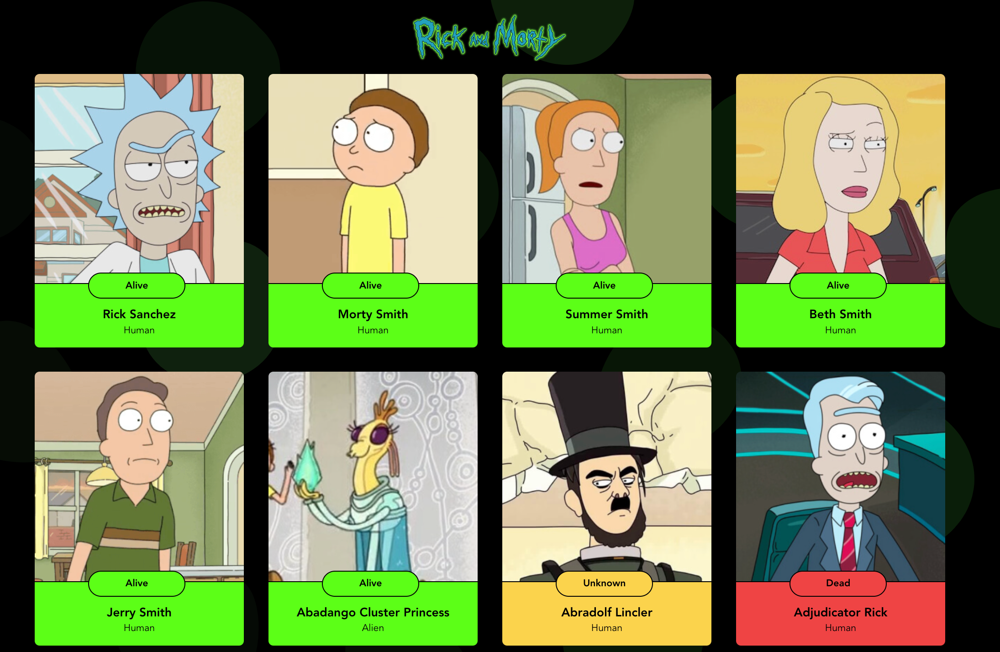

## Tarea:  Hacer que nuestra pagína de Rick And Morty traiga todos los episodios

### Explicación:
En esta tarea vamos a practicar a consultar or medio de la API todos los personajes de Rick and Morty, para hacer que nuestra página muestre el listado completo de personajes y opcionalmente vamos a incluir una funcionaldiad de paginación a nuestra aplicación

### Pre-requisitos

En esta tarea vamos a usar la API de rick and morty para objeter la información de todos los personajes de esta famosa serie. El endpoint que nos interesa en esta tarea es `GET https://rickandmortyapi.com/api/character/`, el cual nos traerá la información detallada de todos los personajes de la serie, Esta información viene páginada y por defecto siempre veremos la primera pagina, pero si queremos ver la información de otra página solo debemos enviar el parámetro `page` en la URL, por ejemplo:

  - Si haces un GET a https://rickandmortyapi.com/api/character/?page=1 verás la información de la primera página. Este llamao es quivalente a solo enviar la petición a esta URL https://rickandmortyapi.com/api/character/ (por defecto el endpoint retorna la primera página)
  - Si haces un GET a https://rickandmortyapi.com/api/character/?page=2 verás la información de la segunda página
  - Si haces un GET a https://rickandmortyapi.com/api/character/?page=10 veras la página 10

Este endpoint te traera una respuesta como la siguiente, si te das cuenta tienes un objeto "info" con la información referente a la paginación y con la URL que debes usar para consultar la siguiente página y la anterior. Además el endpoint te retorna una propiedad "results" que es un arreglo con todos los personajes, este resá el arreglo que usaremos para mostrar el listado de personajes.
```javascript
  {
    "info": {
      "count": 826,
      "pages": 42,
      "next": "https://rickandmortyapi.com/api/character/?page=2",
      "prev": null
    },
    "results": [
      {
        "id": 1,
        "name": "Rick Sanchez",
        "status": "Alive",
        "gender": "Male",
      },
      ... // Información de los demás personajes
    ]
  }
```

### Pasos a seguir:

#### Usando Hooks para mostar el listado de personajes provenientes de la API

Ahora vamos a consultar la información de el personaje desde la API

1. Primero vamos a modificar nuestro archivo `App.jsx` elimiando als variables creadas en al clase anterior para que ahora traiga la información de todos los personajes. para ello vamos a dejar solamente una variable de estado llamada `charactersList`, así:

  ```javascript
    const [charactersList, setCharactersList] = useState([]);
  ```

2. Despues vamos a borrar el llamado a la BD creado en la tarea pasada y lo reemplazaremos por un  `fetch` para consultar la información todos los personajes y la respuesta almacenarla en la variable creada en el paso 1

3. Finalmente utiliza la variables de estado creada en el paso 1 para renderizar el componente una cuadricula CharacterCard.

```javascript
import React from 'react';
import CharacterCard from './components/CharacterCard';

function App() {
  // Paso 1. 
  const [charactersList, setCharactersList] = useState([]);

  // Paso 2
  useEffect( () => {
        // Este useEffect se ejecutará una única vez cuando el componente se monte
        fetch("https://rickandmortyapi.com/api/character/?page=1")
        .then((response) => response.jsxon()).
        .then((data) => 
            // Acá podemos procesamos la respuesta de el endpoint
            console.log(data); // Resultado de el endpoint

            // Utiliza la variable data para actualizar la variable de estado de el paso 1
            setCharactersList(data.results);
        );
    }, [])  


  return (
    <div>
      <h1>Personajes de Rick and morty</h1>
      {/* 
        Paso 3. Uuando la variable creada en el paso 1, debes usar map para leer todos 
        personajes e ir agreando al doom el detalle de cáda uno usando el componenete 
        CharacterCard.jsx creado en la clase pasada. 
      */}
      <div>
        {
          charactersList.map( (characters) => (
            // TODO: usa el map para agregar al DOM el detalled e cada personaje 
            // usando el componente CharacterCard.jsx
            <CharacterCard 
              name={}
              image={}
              genre={}
              status={}
            >
          ))
        }
      </div>
      
      {/*
        OPCIONAL: Inclute un componenet de paginación y haz que la variable de el paso 1 
        se actualice dinamicamente con la información de cáda página
      */}
    </div>
  );
}

export default App;
```

4. Recuerda añadir estilos como por ejemplo flex-box o grid view para que  tu pagina muestre el listado de personajes de una forma más amigable. Ejemplo:



#### Incluyendo paginación (Opcional)

Como reto te invitamos a incluir un compoennete de paginación en tu pagina, la idea fundamental es que agreges un componente como el siguiente 


Tu componenete debe funcionar de la siguiente forma. Cada vez que el usuario de click en un boton se debe hacer la consulta a la API de la pagina correspondiente (Ver la sección pre-requisitos para entender como funciona la paginación en la API), y con el resultado debes actualizar la variable de estado `setCharactersList` creada en el paso 1, de esta forma al modificar la avriable de esatdo tu pagina mostrará automáticamente los resultado de la siguiente página.

**Tip:** Puedes empezar solo con los botones de siguiente pagina y anterior