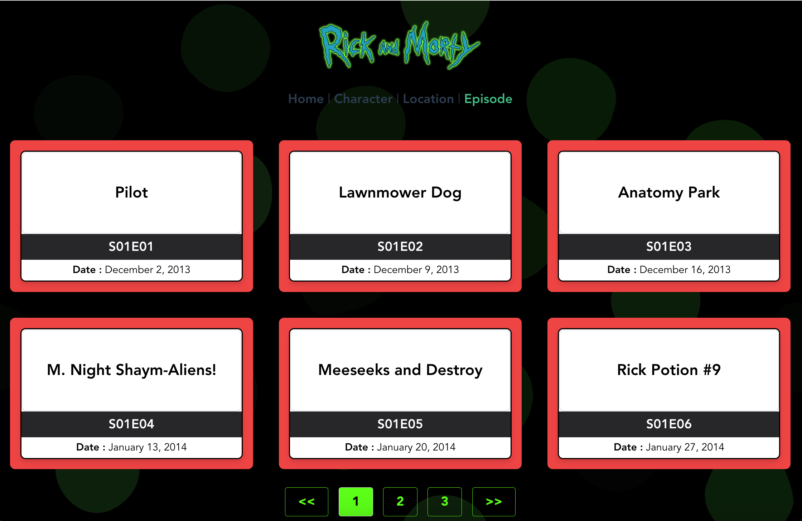

## Tarea: Crear una aplicación de una sola página con múltiples rutas

### Explicación:
Continuando con nuestro poryecto de Rick and morty, en esta tarea crearemos una aplicación de una sola página (SPA) utilizando React Router para gestionar múltiples rutas y mostrar diferentes componentes según la URL. A través de esta tarea, aprenderás a configurar y utilizar React Router para la navegación entre diferentes vistas en una aplicación de React. 

**Importante:** Para que tengas una guía, vamos a crear una página similar a está: https://rick-and-morty-vue.vercel.app/

### Pasos a seguir:

1. **Instalación de React Router:**

Abre una terminal en el directorio de tu proyecto.
Ejecuta el siguiente comando para instalar React Router:

```bash
npm install react-router-dom
```

2. **Creaciòn de las páginas:**

  - **Página de Home**: Crea un archivo llamado `CharacterPage.jsx` que mostrara el listado de pensonajes de Rick and morty paginado (lo mismo que tienes actualmeneteb en tu App.jsx).

    ```javascript
    import React from 'react';

    // TODO: agrega estilos un diseño personalizado a la página
    function HomePage(props) {
      return (
        <div>
          <h1> Bienvenido a la pagina de rick and morty
          </h1>

          <h3> Enlaces rápidos </h3>
          
          <Link to="/characters">
            Ir a personajes
          </Link>
          <Link to="/episodes">
            Ir a episodios
          </Link>
        </div>
       
      );
    }
    export default HomePage;
    ```

  - **Página de listado de personajes**: Crea un archivo llamado `CharacterPage.jsx` que mostrara el listado de pensonajes de Rick and morty paginado (lo mismo que tienes actualmeneteb en tu App.jsx).

    ```javascript
    import React from 'react';

    function CharacterPage(props) {
      // Copia todo el contenido que tienes en App.jsx para hacer que esta pagina renderice el listado de personajes paginado
    }
    export default CharacterPage;
    ```

  - **Pagina NotFound.Jsx**: Crea una página sencilla que usaremos para mostrar un mensaje cuando el usuario intente entrar a una URL que no existe.

    ```javascript
    import React from 'react';

    function NotFoundPage(props) {
      return <h1>Page Not found</h1>;
    }
    export default NotFoundPage;
    ```

  - **Página de episodios (Opcional)**: Ahora vamos a crear una nueva página llamada `EpisodesPage.jsx`, en esta pagina vas a usar la API de rick and morty para listar los episodios de la serie. Esta nueva pagina es muy similar a la pagina de Personajes pero aca vas a usar el enpoint `GET https://rickandmortyapi.com/api/episode?page=1` para listar y paginar los episodios. El diseño de esta pagina es libre pero se puede ver así:

    

3. **Configuración de las rutas:**

Abre el archivo App.jsx y borra el contenido que pasaste a el archivo `CharacterPage.jsx` en el paso 2.

Importa los componentes necesarios de React Router funcione, al final tu archivo debería verse similar a este:
```javascript
import { BrowserRouter as Router, Route, Routes } from 'react-router-dom';
import HomePage from 'HomePage';
import CharacterPage from 'CharacterPage';
import EpisodesPage from 'EpisodesPage';
import NotFoundPage from 'NotFoundPage';

// Define los componentes que deseas mostrar en diferentes rutas.
// Configura las rutas utilizando el componente Router y Routes:

function App() {
  return (
    <Router>
      <div>
        <Routes>
          <Route path="/" exact element={HomePage} />
          <Route path="/characters" element={CharacterPage} />
          {/* La ruta de episodios es opcional, incluyela si la creaste en el paso 2*/}
          <Route path="/episodes" element={EpisodesPage} />
          <Route element={NotFoundPage} />
        </Routes>
      </div>
    </Router>
  );
}
```

4. Navegación entre rutas:

Agrega enlaces (<Link>) en tus componentes para permitir la navegación entre las diferentes rutas.
Utiliza el componente NavLink para estilizar los enlaces activos.

5. Ejecución del proyecto:

Guarda todos los cambios realizados.
Ejecuta el proyecto de React utilizando el comando npm start.
Visita http://localhost:5173 en tu navegador y navega entre las diferentes rutas para verificar el funcionamiento de la aplicación.

Con estos pasos, habrás creado una aplicación de una sola página con múltiples rutas utilizando React Router. Esta tarea te permitirá practicar la configuración y el uso de React Router para la navegación entre diferentes vistas en una aplicación de React.

### Reto:

Crea una pagina que reciba un atributo llamado `id` es decir tu página debe tener la siguiente ruta `/character/:id` de esta forma cuando clicques en la tarjeta de un personaje te debe llevar a esta página y en ella vas a mostrar una pagina con el detalle de ese personaje. 

**Nota** Para ver el detalle de un personaje por ID, puedes usar el componente  `RickAndMortyCharacterCard.jsx` que creaste como reto en la tarea 4.

**Pseudo codigo:**
```javascript
import { BrowserRouter as Router, Route, Switch } from 'react-router-dom';
function App() {
  return (
    <Router>
      <div>
        <Routes>
          
          {/*Otras rutas */}

          <Route path="/characters/:id" element={RickAndMortyCharacterCard} />
          <Route element={NotFoundPage} />
        </Routes>
      </div>
    </Router>
  );
}
```


