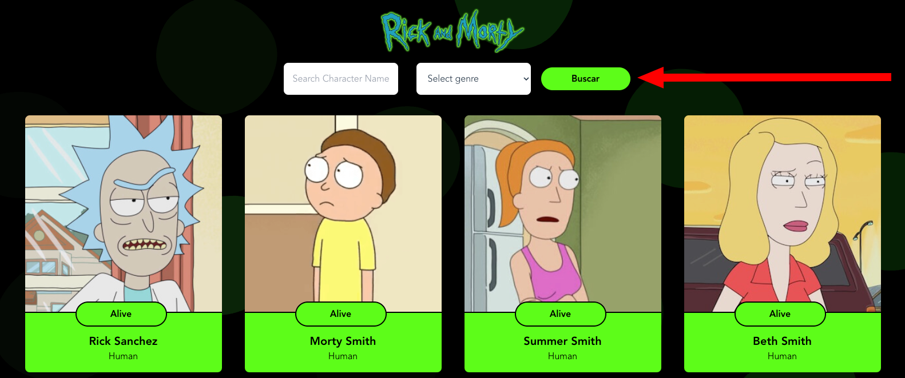

## Tarea: Agregar filtros a la página de Rick and Morty

### Explicación:
Continuando con nuestro poryecto de Rick and morty, vamos a agregar filtros a la página principal para poder filtrar el listado de personajes

### Pre-requisitos

Vamos a continuar trabajando con al API, recordemos que el `GET https://rickandmortyapi.com/api/character/` nos trae el listado de personajes, pero tabien podemos pedirle a el backend que nos retorne estos personajes filtrados usando query params. Los filtros disponibles son:

  - `name`: Parámetro usado para filtar por nombre.
  - `status`: Parámetro usado para filtar por estatus (alive, dead or unknown).
  - `type`: Parámetro usado para filtar por tipo.
  - `gender`: Parámetro usado para filtar por genero (female, male, genderless o unknown).

De esta forma si quieres filtrar los personajes que tengan el nombre `rick` solo debes consultar la API de la siguiente forma `https://rickandmortyapi.com/api/character/?name=rick`. o si quieres consultra los personajes con `status=alive` solo debes hacer el llamado a este endpoint `https://rickandmortyapi.com/api/character/?status=alive`

Recuerda que al ser parametros de query puedes enviar más de uno separados por el caracter `&` de esta forma el llamado a la API `https://rickandmortyapi.com/api/character/?name=rick&status=alive` te va atraer todos los personajes cuyo nombre contenga la palabra rick y que además tengan la propiedad status=alive.

### Pasos a seguir:

1. Vamos a usar una variable de estado donde vamos almacenar el valor del input

```javascript
const [query, setQuery] = useState('');
```
2. Luego tenemos que usar dos hooks useNavigate() y el useLocation donde vamos almacenar el valor de la variable query
```javascript
  const navigate = useNavigate()
  const urlData = useLocation()
```

Ejemplo
```javascript
  navigate(`/?character=${query}`);
```
3. Luego de declarar el parametro que vamos agregar en la url se la pasamos al Hook URLsearchParams()

```javascript
const queryParams = new URLSearchParams(urlData.search)
```

4. Agrega un evento onClick al boton o onSubmit si estamos utilizando la etiqueta form , de esta forma cuando des click en buscar vas a poder usar las variables de estado creadas en el paso número 1 para poder lanzar nuevamente la llamada a la API y actualizar el listado de personajes

```javascript
  useEffect(() => {
    
    const metodoDondeSeEjecutaElApi = async () => {
      if (/** Aqui agregar la condicion para cuando traiga el param**/) {
        const url = `https://rickandmortyapi.com/api/character/?name=${/**Agregar la logica del parametro**/}`;
        /**
        Logica normal del consumo del api
        el try catch
        **/
      } else {
        /*
        y si no se cumple la condicion del if() entonces se ejecutara esta ruta donde te redirigira al home 
        */
        const url = `https://rickandmortyapi.com/api/character/`;
        /*
        Logica del consumo del api
        el try catch
        */
      }
    }; 
    fetchCharacters();
  }, [/*hacer el llamado de la constante que esta agregando los parametros a la url*/]);
```

2. Agrega a el archivo App.jsx un formulario y los componentes necesarios para poder filtrar, por ejemplo tu página deberia verse ahorá asi:


2. Agrega un evento onClick a el botón buscar, de esta forma cuando des click en buscar vas a poder usar las variables de estado creadas en el paso número 1 para poder lanzar nuevamente la llamada a la API y actualizar el listado de personajes

```javascript
const onSearch = () => {

  // Haciendo el llamado a la API
  fetch("https://rickandmortyapi.com/api/character/" + filterParams)
    .then((response) => response.json()).
    .then((data) => 
        // Acá podemos procesamos la respuesta de el endpoint
        console.log(data); // Resultado de el endpoint

        // Utiliza la variable data para actualizar la variable de estado de la tarea anterior
        setCharactersList(data.results);
    );
}
```

#### Reto: Incluye más filtros a tu página

Como reto te invitamos a incluir inlcuir más filtros como por ejemplo un filtro por `status` (alive, dead or unknown)
