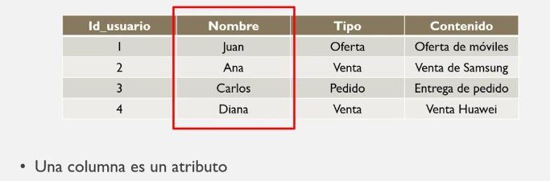
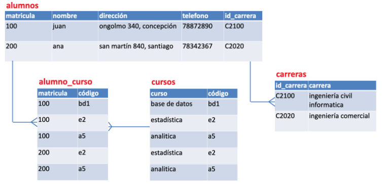
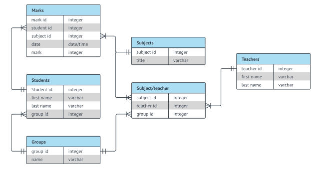
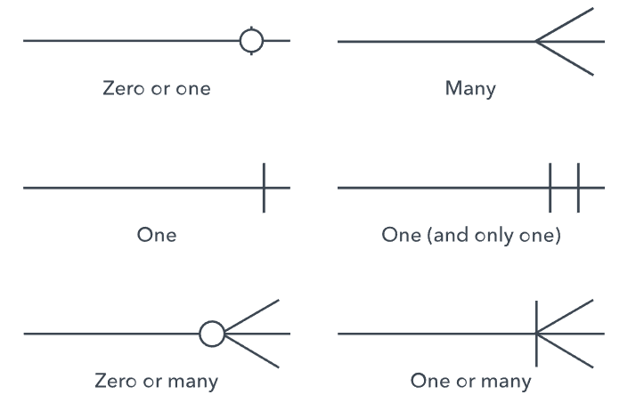
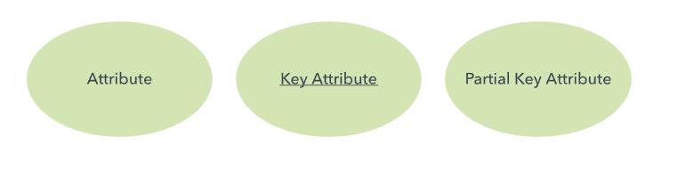
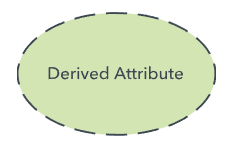
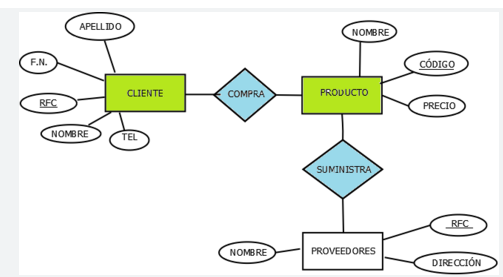
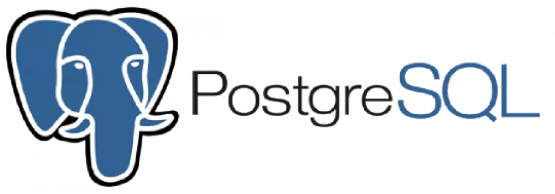

# Bases de Datos

El desarrollo de software tiene como objetivo transformar datos crudos en información de valor para los usuarios finales, poniendo un ejemplo, pensemos en una aplicación de correo electrónico, esta almacena información de los usuarios como sus correos recibidos, enviados y por supuesto la información e identificadores únicos de cada usuario, esta información como tal así sola no cobra tanto valor, pero cuando un identificador lo podemos usar para enviar correos a determinado usuario, o podemos utilizar los correos guardados para visualizarlos en nuestra aplicación y responder o reenviar correos, aquí es cuando la información toma valor.

Si lo miramos así, todas las aplicaciones tienen en común eso, datos crudos que ya sea simplemente mostrandolos al usuario o computandolos para transformarlos, este proceso le da valor a los datos para el usuario final, entonces, los datos son una parte fundamental de una aplicación, es lo que le da sentido.

Ya vimos como disponibilizar backends, como desarrollar frontends que son elementos que transforman y muestran datos pero no hemos visto otra parte del desarrollo fundamental y es que cuando construimos una aplicación necesitamos entender los datos que esta manejará y también como y donde los almacenará para tenerlos disponibles cuando sea necesario.

Para este campo del desarrollo de software surgen las `bases de datos` estas son software que se encarga de organizar nuestros datos de manera que tengan una persistencia, un orden para poder acceder a ellos cuando se requiera de una manera eficiente y una estructura que también nos ayude con la eficiencia.

Pueden ser muchas las necesidades con respecto a los datos que manejamos, consideraciones desde el como los almacenamos y accedemos a ellos hasta la estructura como los almacenamos. Para todos estos condicionales y muchos mas exiten soluciones estandar que podemos modificar cuanto necesitemos para adaptarlas a nuestras necesidades, miremos las adaptaciones mas comunes.

## Bases de datos relacionales

Empecemos mirando las bases de datos relacionales, estas son una recopilación de datos con relaciones predefinidas entre ellos, estos elementos se organizan en tablas con columnas y filas; las tablas se utilizan para guardar información de los objetos que van a representar los datos en la base de datos, cada columna de una base de datos puede almacenar un tipo de dato y cada fila representa un registro de la tabla. Cada tabla tendrá como minimo una columna la cual será un identificador único de cada registro, esta llave es llamada `clave principal` o `primary key (PK)`. Miremos un ejemplo gráfico de una tabla de una base de datos relacional.



Como vemos en la imagen, podemos asociarlo con una tabla en una hoja de calculos de Excel, como vemos es una tabla donde los nombres de las columnas están arriba y las filas representan registros de datos, en este ejemplo solo podemos notar dos tipos de datos definidos, por ejemplo, de la primera columna podríamos decir que es númerica y de las demas que son de cadenas de texto.

Así se ve la estructura basica de una tabla de una base de datos relacional, en este caso por la información contenida podríamos llamar la tabla por ejemplo `OfertasUsuarios` o algo por el estilo pues como vemos la tabla relaciona usuarios con ofertas sobre distintos contenidos.

Puede pasar que en ocasiones algunas columnas para algunos registros no presenten valor, estas serían columnas definidas como opcionales pero todos los elementos contenidos dentro de una tabla deben tener la misma estructura, si quisieramos ingresar un nuevo registro cuyo nombre en lugar de llamarse Nombre fuera por ejemplo Apodo, no funcionaría pues debe cumplir con la estructura predefinida de la tabla que para casos de ejemplo llamamos `OfertasUsuarios`.

Miremos ahora una tabla pero esta vez un poco más compleja donde podamos ver mas elementos.



Como notamos, en esta ahora tenemos 4 tablas diferentes conectadas por lineas, ya veremos esas lineas que significan, lo importante es notar como en este caso la tabla principal que es la de alumnos se relaciona con otras que a su vez relacionan registros mediante identificadores únicos, por ejemplo, matricula la vemos presente en la tabla `alumnos` y en la tabla `alumnos_curso`, como podemos deducir, este identificador relaciona los registros de `alumnos` con los registros de `alumno_curso` que a su vez se relacionan con los registros de `cursos`, por tanto podemos tener traza de cada alumno en base a su matricula que cursos tiene, esto se separa de esta manera por buenas practicas que hacen referencia a las `formas normales` de las estructuras de bases de datos, este concepto de buenas practicas lo miraremos a continuación.

Entendiendo de manera breve como funcionan las tablas de las bases de datos pasemos ahora a mirar un poco mas a profunidad las estructuras que pueden tomar estas tablas.

## Modelos entidad relación

Los modelos entidad relación también conocidos como MER o diagramas entidad relación es un tipo de diagrama de flujo donde se representan los distintos objetos que conforman un sistema, sus propiedades y como se relacionan entre si.

En el sentido de las bases de datos relacionales nos sirven para eso exactamente, identificar cada modelo de datos de nuestro sistema y describir sus propiedades y relación con los demas. Miremos un ejemplo.



Este ejemplo es bastante completo, vemos muchos elementos. Lo primero y mas facil de identificar son los objetos o modelos del sistema, los cuales se representan con las tablas con cabecera azul donde la cabecera es el nombre de la entidad, luego tenemos las propiedades de cada entidad en la primera columna y luego en la segunda el tipo de valor que contendrían, eso es lo que compone los objetos o entidades. Ahora siguiendo con como se relacionan entre si, notamos lineas con distintas puntas que unen las tablas, estas puntas lo que indican son un concepto que se llama `cardinalidad`, esta define la manera como se relacionan las tablas en terminos numericos, miremos las cardinalidades para entenderlo mejor



Como vemos cada diferente terminación de una punta se refiere a un número, estas definen la cantidad de objetos que se pueden relacionar con otros en base a la terminación de la unión, expliquemoslo con un ejemplo.

Miremos la relación entre la tabla `Students` y `Marks`, como vemos la punta que da con la tabla `Marks` es la que corresponde a la punta `One or Many`, es decir, muchos o uno y luego para el caso de la punta que da con la entidad `Students` es de `One and only one` lo que podríamos leer entonces para el caso partiendo de Student como un `Student` puede tener muchas notas de materias o una y al reves sería, una o muchas notas de materia pueden estar asociadas a un y solo un estudiante.

Luego, con las cardinalidades podemos pasar a reglas de interpretación mas explicitas como según el ejemplo pasado, un estudiante tiene que tener como minimo unas notas de una materia, puede tener varias pero como minimo una y viendolo al reves, significa que una o muchas notas de una materia solo pueden estar asociadas a un estudiante, varios estudiantes no pueden compartir las mismas notas.

Los modelos entidad relación son muy susceptibles a modificaciones en cuanto a su elaboración dependiendo del contexto y por supuesto las practicas que cada equipo adopte, con solamenta las cardinalidades y las entidades se puede representar un modelo relacional, estos son los elementos mas basicos, luego se puede también agregar mas elementos para mas detalle, debemos tener cuidado de no entorpecer la legibilidad de nuestro modelo con demasiados detalles. Miremos algunos de los "extras" mas vistos.

En algunos casos se utilizan objetos ovalados para presentar las propiedades de las entidades y cuadrados para representar las entidades meramente con su nombre, luego a cada entidad se le relacionan los atributos con formas diferentes según dependa, miremoslo.



Como vemos, el primero es el atributo basico, así como los veíamos a manera de columnas con tipo y nombre en la imagen del MER de ejemplo, aquí serían objetos separados de la entidad unidos por una linea continua. Luego tenemos uno cuyo nombre va subrayado, este lo que indica es un atributo clave, mas adelante miraremos que implican los atributos claves pero por ahora entender que son atributos cuyo valor es único en todos los registros de una entidad y son usados para identificar el registro. Finalmente tenemos el atributo partial key el cual representa un atributo que en conjunto con otro u otros forman una key.



El cual es utilizado para atributos que son derivados de otra tabla, por ejemplo miremos el caso de la tabla `Mark` que tiene un atributo que es studentId, ese atributo viaja hacía `Mark` como un atributo derivado de la relación con el registro de `Student`.

Miremos un ejemplo de aplicaciones de este modelo en MER.



Como vemos, en este caso las relaciones se expresan como un objeto con forma de rombo el cual con un verbo expresa la relación entra las entidades, luego evidenciamos los atributos de cada entidad y sus atributos `key` subrayados.

## Qué es SQL

SQL es un acrónimo en inglés para Structured Query Language. Un Lenguaje de Consulta Estructurado. Un tipo de lenguaje de programación que nos permite manipular y descargar datos de una base de datos, este lenguaje tiene la capacidad de hacer calculos condicionales avanzados de y de algebra.

Las bases de datos relacionales trabajan con SQL como base para las lógicas de base de datos y ejecución de consultas, sin embargo, todas tienen extensiones desarrolladas por los creadores de estos motores de base de datos lo que generan cambios en la sintaxis y en general de las funciones que podemos utilizar, sin embargo, si entendemos la base de SQL tendremos bases para aplicar sobre cualquier tipo de extensión de SQL, miremos algunas de estas extensiones y luego un query de ejemplo.

- MySQL
- Microsoft SQL Server
- PostgreSQL
- Oracle PLSQL

Estos son los mas conocidos y utilizados del mercado, todos trabajan con base a SQL pero cada uno tiene sus consideraciones especificas por supuesto dignas de una especialización.

En general las reglas basicas son las mismas, miremos los comandos basicos del SQL

- `SELECT:` Nos permite "seleccionar" o hacer consulta de datos para obtener
- `WHERE:` Nos permite aplicar filtros sobre los resultados de un SELECT
- `INSERT:` Utilizado cuando requerimos de insertar datos
- `DELETE:` Usado para eliminar datos
- `UPDATE:` Lo usamos cuando requerimos de actualizar datos

Miremos un ejemplo basico de un query SQL

```sql
SELECT * FROM clientes WHERE Ciudad = "Barcelona"
```

En este caso luego del SELECT, van los atributos que queremos traer de los registros de la tabla, en este caso al utilizar el simbolo `*` significa que queremos traer todos los atributos, luego el FROM lo utilizamos para indicar la tabla a consultar y hasta ahí podríamos dejar nuestro query, pero en este ejemplo agregamos una clausula WHERE la cual nos sirve para filtrar los resultados, entonces va a traer todos los atributos de los registros de la tabla cliente cuya propiedad `Ciudad` sea "Barcelona".

Esto es lo que debemos entender por ahora del SQL, cuando miremos su aplicación profundizaremos mas en todas sus posibilidades.

## Introducción a PostgreSQL



PostgreSQL o como es comunmente llamada Postgres es un sistema de código abierto de administración de bases de datos relacionales, basa las consultas en SQL.

Postgres es muy preferida en el ambito profesional por sus tipos de datos avanzados los cuales permiten tener optimizaciones de rendimiento destacadas por encima de otras bases de datos.

El software es totalmente gratuito, multiplataforma, facil de usar y permite manejar un gran volumen de datos de una manera muy eficiente, por tanto es una base de datos para ambitos profesionales de todo tipo muy cotizada. En este caso para los ejercicios que hagamos de bases de datos relacionales utilizaremos PostreSQL cuya instalación miraremos en el siguiente módulo.

## Final del módulo

Llegamos al final de este módulo donde vimos la introducción teórica de lo que va a ser los modulos finales, las bases de datos especificamente las relacionales, en siguientes módulos antes de pasar con las bases de datos no relacionales, profundizaremos sobre todo lo que necesitamos saber de las bases de datos enfocandonos en Postgres y su implementación en proyectos Backend.
