# PostgreSQL

En este módulo vamos a profundizar en temas de querys SQL y en general de elementos conceptuales y practicos de bases de datos, vamos a utilizr según se indico en el módulo pasado Postgres, vamos a iniciar con su instalación y a lo largo del módulo miraremos todas las herramientas que necesitamos para crear una base de datos e interactura con ella, desde crear las tablas, las relaciones y los querys para realizar consultas.

## Instalación PostgreSQL Admin

Lo primero que vamos a hacer es instalar el software con el que trabajaremos con nuestra base de datos.

Para descargar los archivos de instalación nos podemos ir al siguiente link:

[Descargar archivos instalación](https://www.postgresql.org/ftp/pgadmin/pgadmin4/)

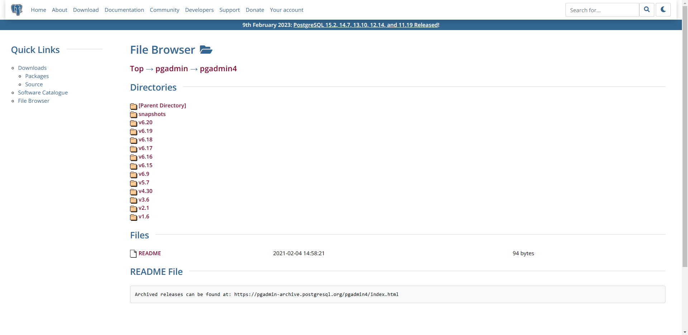

Seleccionamos la ultima versión recomendada

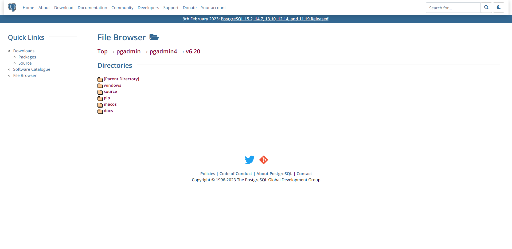

Seleccionamos nuestro sistema operativo

Instalamos según las instrucciones dadas en la sección de cada sistema operativo, en la instalación no se realiza ninguna configuración que requiera de detalle, simplemente dejamos todo como está configurado de inicio.

Luego tendremos que ir al siguiente link de descarga de PostgreSQL

[PostgreSQL](https://www.enterprisedb.com/downloads/postgres-postgresql-downloads)

Una vez aquí se presentará la pantalla de descargas, dependiendo de nuestro sistema operativo seleccionaremos la descarga adecuada.

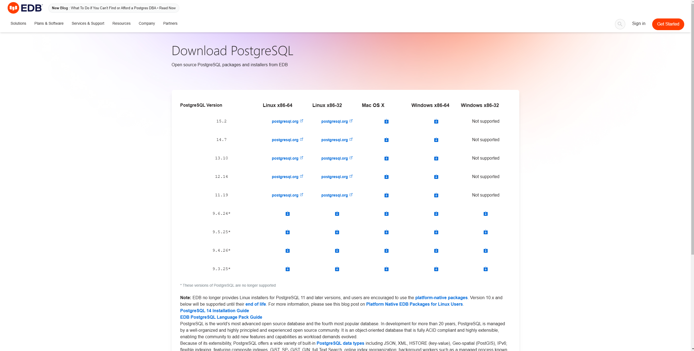

Una vez inicie la instalación independiente del medio por el cual estemos instalando el motor se nos preguntará por una contraseña, la anotaremos y la guardaremos en un lugar seguro, el puerto se recomienda dejarlo como por defecto en 5432 y el resto de configuraciones como vienen predeterminadas.

Esta instalación es necesaria para ejecutar un servicio de Postres en nuestra maquina, la primera descarga es para administrar dicho servicio. Una vez finalice la instalación tendremos PostgreSQL instalado en nuestra maquina, continuaremos con el primer programa descargado.

Una vez iniciemos la aplicación por primera vez esta nos preguntará por la clave que queremos, asignamos cualquiera y la guardamos en un lugar seguro.

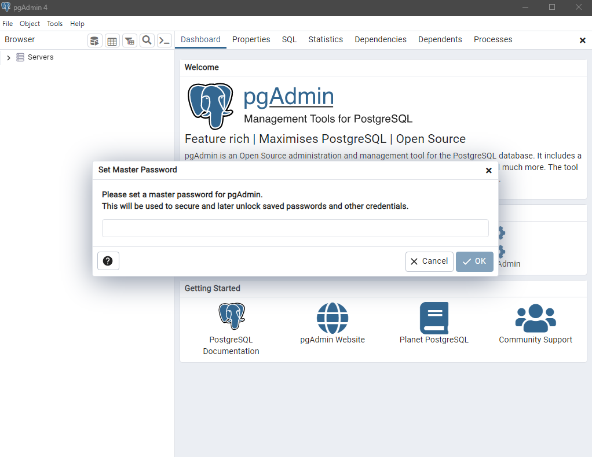

Una vez en la aplicación haremos clic en la opción Add New Server.

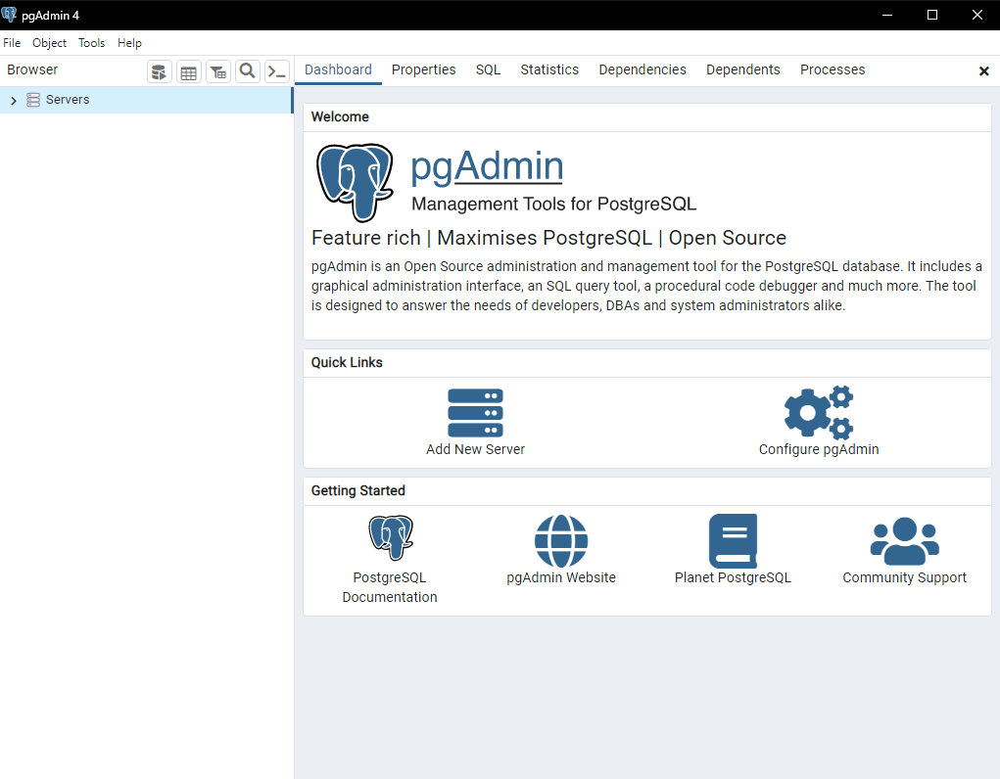

Se nos abrirá un panel para configurar el nuevo servidor

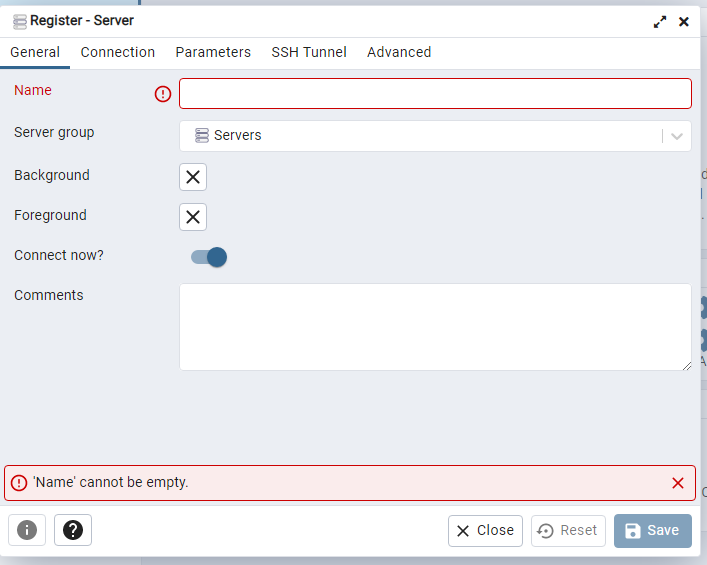

En este solamente colocaremos un nombre que queramos y en connection en address colocaremos `localhost`, si nuestra instalación es correcta nos abrirá el servidor inicializado al instalar PostreSQL en nuestra maquina.

Entonces en el panel izquierdo de nuestra aplicación aparecerá el servidor, al abrirlo veremos su contenido y una sección llamada Databases.

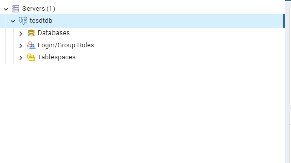

Haremos clic derecho sobre Databases y haremos clic en create database. Se nos abrirá un panel en el cual basta con asignarle un nombre a nuestra base de datos y dar clic en crear. Ahora aparecerá en esta lista de base de datos.

Ahora haremos clic sobre nuestra base de datos y usaremos la opción que dice Query Tool

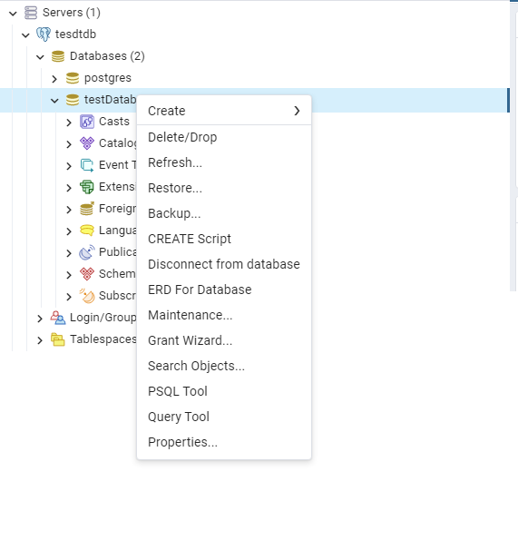

Esto nos abrirá un editor de texto como el siguiente.

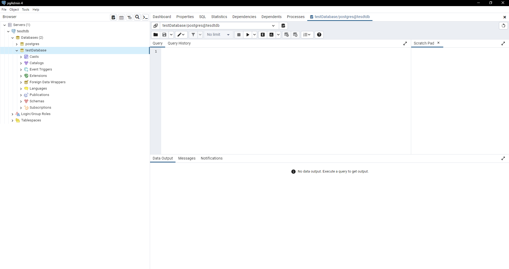

En este editor podremos digitar nuestras sentencias SQL y ejecutarlas con el botón de reproducir o con F5 en caso de Windows. Llegados a este punto estamos listos para empezar a desarrollar nuestro ejercicio.

Para este ejercicio vamos a desarrollar una pequeña base de datos para gestionar la información de los usuarios de una pagina web. Empecemos

## Creando las tablas

La primera parte del ejercicio consiste en construir las tablas, miremos entonces la sentencia `CREATE TABLE`.

Esta sentencia nos sirve para indicarle a la base de datos que cree una tabla según las propiedades que acompañan la instrucción, miremos la estructura basica de una sentencia CREATE TABLE.

```sql
CREATE TABLE IF NOT EXISTS table_name (
   column1 datatype(length) column_constraint,
   column2 datatype(length) column_constraint,
   column3 datatype(length) column_constraint,
   table_constraints
);
```

Lo primero que debemos notar de la sentencia es el titulo inicial que es el CREATE TABLE, podríamos dejarla hasta ahí pero en caso de ya existir la tabla nos generará una excepción porque la tabla ya existe, en cambio si le agregamos la sentencia `IF NOT EXISTS` en caso de que la tabla ya exista no la creará pero tampoco generará el error.

Luego, lo siguiente que notamos luego del nombre de la tabla a crear son 3 elementos, el nombre de cada columna, el tipo de dato y las restricciones para dicho campo, miremos los tipos de datos que maneja Postgres

### Tipos de datos

- `Booleano:` Representado con `bool` o `boolean` representa positivo o negativo, se hacen las siguientes conversiones
  - `1`, `yes`, `y`, `t`, `true` son convertidos en `true`
  - `0`, `no`, `false`, `f` son convertidos en `false`
- `Character:` PostgreSQL provee tres tipos de caracteres. CHAR(n) VARCHAR(N) y TEXT
  - `CHAR(n)` Es una cadena de tamaño `n` que se rellena con los espacios faltantes, si insertamos un texto de menos de `n` Postgres rellenará lo faltante con espacios en blanco y si intentamos insertar algo con largo `n + 1` fallará.
  - `VARCHAR(n)` En esencia es lo mismo que CHAR solo que este no agrega espacios al final para rellenar el largo del campo
  - `TEXT` Es una cadena de caracteres con largo variable, en la teoría este tipo de dato tiene un largo indefinido, se adapta a la cadena dada
- `Numericos`
  - Para valores `enteros` existen los siguientes diferentes tipos
    - `SMALLINT` que es un entero positivo o negativo de 2 bytes
    - `INT` lo mismo que el SMALLINT pero con mas capacidad, 4 bytes
    - `SERIAL` es un INT pero que Postgres automaticamente genera su valor, es similar al AUTO_INCREMENT de MySQL o AUTOINCREMENT de SQLite
  - Para valores `decimales` hay 3 tipos de datos
    - `FLOAT(n)` es un número decimal cuya precisión va desde `n` como minimo hasta 8 bytes
    - `REAL | FLOAT8` es un valor decimal de 4 bytes
    - `NUMERIC | NUMERIC(p, s)` es un número real con `p` digitos con `s` números luego del decimal
- `De tiempo`
  - `DATE` almacena solo la fecha
  - `TIME` almacena la hora del día
  - `TIMESTAMP` almacena tanto horas del día como fechas
  - `TIMESTAMPTZ` es un timestamp pero con la zona horaria
  - `INTERVAL` almacena un periodo de tiempo

Estos son los tipos de dato principales, luego hay otros mas avanzados pero mucho menos utilizados, con estos valores podemos solucionar cualquier desafio planteado por lo que no profundizaremos en esta sección en los demas.

### Restricciones o `column_constraint` y `table constraints`

Las restricciones son modificadores que podemos aplicar a los distintos tipos de datos de manera de agregar condiciones a dicha columna, miremoslos con sus utilidades. Miremos inicialmente los `column constraints` que son las restricciones de columna.

- `NOT NULL` Asegura que el valor de la columna nunca puede ser NULL
- `UNIQUE` Asegura que el valor de la columna no se puede repetir en otros registros de la misma tabla
- `PRIMARY KEY` Sirve para identificar la llave primaria que identifica el registro en la tabla, una tabla debe tener una y solo una columna identificada como llave primaria.
- `CHECK` asegura que los datos de la columna deben cumplir con una expresion booleana
- `FOREIGN KEY` Asegura que la columna o un grupo de columnas de la tabla existen en una columna de otra tabla, distinto a la llave primaria, una tabla puede tener tantas llaves foraneas como quiera

Miremos ahora las restricciones pero a nivel de tabla, estas pueden describir cualquier tipo de restricción a nivel de columna pero en adición pueden describir restricciones que involucran varias columnas, el modificador que se utiliza para estos casos es `CHECK`, miremos un ejemplo de su implementación

```sql
CREATE TABLE qualified_borrowers (
    . . .
    account_number int,
    acceptable_collateral boolean,
    . . .
    CHECK (account_number IS NOT NULL AND acceptable_collateral = 't')
);
```

Como vemos se aplica un constraint a nivel de tabla con la combinación de las columnas `account_number` y `acceptable_collateral`, miremos ahora como a estas restricciones se les puede colocar un nombre para que al momento de violarse alguna de estas obtengamos un mensaje informativo que nos ahorrará bastantes dolores de cabeza en tablas complejas insertando o modificando datos.

```sql
CREATE TABLE qualified_borrowers (
    . . .
    account_number int,
    acceptable_collateral boolean,
    . . .
    CONSTRAINT loan_worthiness CHECK (account_number IS NOT NULL AND acceptable_collateral = 't')
);
```

Como vemos en este caso generamos una regla llamada `loan_wothiness` y luego definimos la regla que la identifica, de esta manera al generarse un error por esta regla será mostrado en el mensaje de error.

Ahora vistos todos los elementos que conforman la creación de una columna iniciemos entonces con la creación de los querys.

Para el caso de la creación de la tabla User que es la primera que utilizaremos necesitamos un id que sea auto generado con auto incremento, el nombre del usuario, la edad, el genero y la fecha de nacimiento, miremos como construiríamos el query.

```sql
CREATE TABLE IF NOT EXISTS tblUser (
	id serial PRIMARY KEY,
	name varchar(250) NOT NULL,
	age integer NOT NULL,
	gender varchar(250) NOT NULL,
	birthdate date NOT NULL
);
```

Como notamos, todas las columnas tienen restricción NOT NULL, esto para asegurarnos que ningun Usuario pueda ser ingresado con la información incompleta, luego como vemos utilizamos tipos de datos según la información que vamos a guardar y para el caso del la llave primaria la definimos como serial con la intención de que sea un entero auto incremental.

Continuemos con esta creación de tablas, vamos a necesitar saber la ciudad y país donde viven nuestros usuarios, por tanto vamos a crear una tabla intermedia donde se almacene la relación de un usuario con la ciudad donde vive, lo hacemos de la siguiente manera.

```sql
CREATE TABLE IF NOT EXISTS tblCity (
	id serial PRIMARY KEY,
	name varchar(250) NOT NULL
)
```

Luego, para tener registro de las relaciones entre ciudades y usuarios tendríamos que utilizar una tabla intermedia, la creamos así.

```sql
CREATE TABLE IF NOT EXISTS tblUserCity (
	id serial PRIMARY KEY,
	idUser int NOT NULL,
	idCity int NOT NULL,
	CONSTRAINT fkIdUser
		FOREIGN KEY(idUser)
			REFERENCES tblUser(id),
	CONSTRAINT fkIdCity
		FOREIGN KEY(idCity)
			REFERENCES tblCity(id)
);
```

Como notamos, debemos agregar la restricción de las llaves foraneas luego de definirlas.

De esta manera podemos asociar las ciudades con los distintos usuarios cruzando los id. Ahora, agreguemos otro detalle, queremos tener dato de los países de los cuales son las ciudades de nuestros usuarios, se haría de una manera similar pero esta vez relacionando la tabla City con la tabla Country de la siguiente manera

```sql
CREATE TABLE IF NOT EXISTS tblCountry (
	id serial PRIMARY KEY,
	name varchar(250) NOT NULL
);

CREATE TABLE IF NOT EXISTS tblCityCountry (
	id serial PRIMARY KEY,
	idCountry int NOT NULL,
	idCity int NOT NULL,
	CONSTRAINT fkIdCountry
		FOREIGN KEY(idCountry)
			REFERENCES tblCountry(id),
	CONSTRAINT fkIdCity
		FOREIGN KEY(idCity)
			REFERENCES tblCity(id)
);
```

De esta manera podemos de la misma forma que asociamos un usuario con su ciudad, una ciudad con su país y por tanto cada usuario con su respectivo país.

Mediante PG Admin podemos acceder visualmente a nuestras tablas y ver toda su información, al crearlas y refrescar el menú de navegación podremos visualizarlas con todas sus propiedades. La ruta que debemos seguir es `Servers -> Nuestro servidor -> Database -> Nuestra base de datos -> Schemas -> public -> Tables`

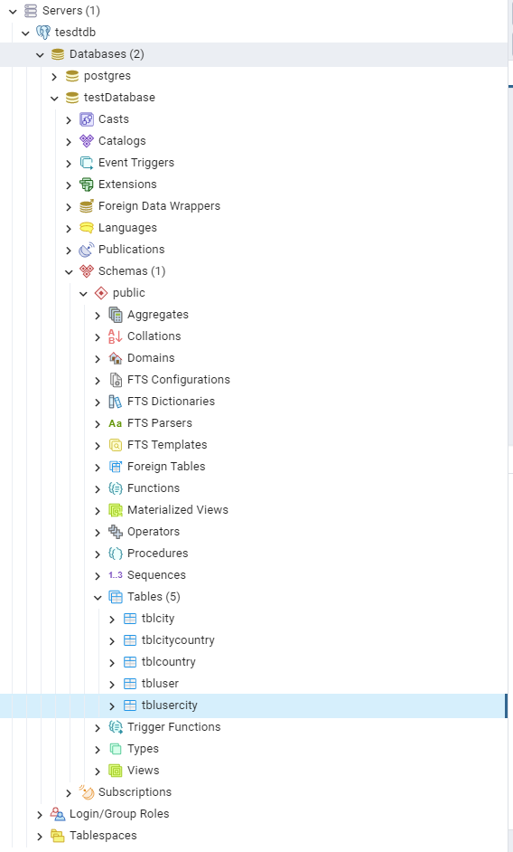

## INSERT, UPDATE, DELETE

Ahora que tenemos nuestras tablas, miremos como las podemos poblar con datos.

Como habíamos mencionado, la sentencia SQL para insertar datos a nuestras tablas es INSERT, miremos la estructura basica de esta y luego los elementos que la componen.

```sql
INSERT INTO table_name(column1, column2, …)
VALUES (value1, value2, …);
```

Como vemos primero tenemos INSERT INTO y luego debemos indicar el nombre de la tabla y sus columnas para finalizar con VALUES seguido de los valores que deben ir en el orden correspondiente a su columna.

Insertemos un par de registros en la tabla country.

```sql
INSERT INTO tblCountry(name) VALUES ('Colombia');
```

De esta sencilla manera ahora en nuestra tabla tenemos un registro con id auto generado y nombre Colombia, solo debemos proveer los valores a columnas que sean obligatorias, las auto calculadas no deben digitarse.

Ahora ingresemos una ciudad a nuestra tabla de ciudades.

```sql
INSERT INTO tblCity(name) VALUES ('Medellín');
```

Y finalmente, creemos entonces una relación en la tabla tblCityCountry de manera que la ciudad Medellín quede relacionada con su país Colombia.

```sql
INSERT INTO tblCityCountry(idCountry, idCity) VALUES (1, 1)
```

Por supuesto, antes de insertar en esta tabla al requerir de relacionar los id de los elementos a relacionar debemos saber los id del país y la ciudad a relacionar, en este caso como solo hay un registro en cada tabla, por supuesto siempre serán el 1.

Así entonces, ya tenemos relacionada una ciudad en nuestra base de datos con su respectivo país.

Ahora ingresemos un usuario.

```sql
INSERT INTO tblUser(name, age, gender, birthdate)
VALUES ('Sultano Perez', 21, 'Male', '2001-09-01');
```

Como vemos las fechas tipo `DATE` las ingresamos en formato ISO 8601 y con las comillas como si se tratara de una cadena de texto.

Luego, digamos que este usuario es de Medellín, Colombia; entonces, queremos agregar la relación con la ciudad a la tabla tblUserCity, miremos como lo hacemos.

```sql
INSERT INTO tblUserCity(idCity, idUser) VALUES (1, 1);
```

> Es importante destacar que cuando insertamos elementos con llaves foraneas Postgres verifica que dichas llaves foraneas si existan, dando lo contrario no se insertará el registro y generará un mensaje de error.

Postgres también nos permite insertar en una misma sentencia INSERT muchos registros proporcionando la lista de registros a insertar, de la siguiente manera.

```sql
INSERT INTO table_name (column_list)
VALUES
    (value_list_1),
    (value_list_2),
    ...
    (value_list_n);
```

Insertemos 3 usuarios a la vez para ver un ejemplo.

```sql
INSERT INTO
	tblUser(name, age, gender, birthdate)
VALUES
	('Fulano Mendoza', 20, 'Male', '2002-08-02'),
	('Perana Tamayo', 23, 'Female', '1999-07-01'),
	('Miltana Restrepo', 21, 'Female', '2001-03-19');
```

De esta manera ahora tenemos 4 registros de usuarios en la base de datos.

Ahora tenemos un registro con el flujo completo de nuestra base de datos, pero, que pasa si tenemos que editar la información de nuestros registros, imaginemos que un usuario se cambió el apellido y quiere que la corrección se vea en sus futuros pedidos. Para estos casos utilizamos la sentencia UPDATE, miremos como se usa en un ejemplo básico.

En este caso, el usuario Fulano Mendoza se cambió su apellido y quiere que aparezcan sus dos apellidos, por tanto su nuevo nombre se desea que sea 'Fulano Cortez Castillo' por lo que debemos actualizar dicho registro. Miremos la estructura basica de un query UPDATE.

```sql
UPDATE table_name
SET column1 = value1,
    column2 = value2,
    ...
WHERE condition;
```

En esta sintaxis como vemos, luego del WHERE va el nombre de la tabla, luego SET y los campos que queremos actualizar, hasta ese punto ya nuestra consulta puede ser ejecutada y no generaría error, pero, ejecutar un query UPDATE sin una clausula WHERE es una practica tan no recomendada como peligrosa y es que si no asignamos una clausula WHERE esta actualización se aplicará para TODOS los registros de nuestra tabla, debemos tener mucho cuidado de esta operación porque podría dañar la información de nuestra tabla, entonces miremos como se constituye una clausula WHERE.

### Condicionales WHERE

Cuando utilizamos la clausula WHERE en cualquier query este tiene unos operadores para verificar condiciones, miremos los distintos operadores que existen en Postgres.

| Operador |                           Descripción                           |                     Ejemplo                     |
| :------: | :-------------------------------------------------------------: | :---------------------------------------------: |
|    =     |                      Operador de igualdad                       |                name = 'Sultano'                 |
|    >     |                      Operador de mayor que                      |                    age > 17                     |
|    <     |                      Operador de menor que                      |                  height < 1.80                  |
|    >=    |                    Operador de mayor o igual                    |               productsCount >= 3                |
|    <=    |                    Operador de menor o igual                    |                  grade <= 3.0                   |
| <> ó !=  |                     Operador de distinto de                     |                name <> 'Fulano'                 |
|   AND    |                        Operador lógico Y                        |          name = 'Sultano' AND age = 13          |
|    OR    |                        Operador lógico Ó                        |       name = 'Sultano' or name = 'Fulano'       |
|    IN    |  Retorna verdadero si el valor coincide con alguno de la lista  |    name IN ('Sultano', 'Fulano', 'Mendano')     |
| BETWEEN  | Retorna verdadero si el valor se encuentra en el intervalo dado | birthdate BETWEEN '1993-01-01' AND '1999-12-31' |
|   LIKE   |       Retorna verdadero si el valor cumple con el patrón        |                 name LIKE 'S%'                  |
| IS NULL  |              Retorna verdadero si el valor es NULL              |                discount IS NULL                 |
|   NOT    |           Niega el resultado de los demas operadores            |               name NOT LIKE '%A'                |

Para los patrones que se pueden utilizar con el operador `LIKE` puede ser con `%` o `_`, el porcentaje hace match con cualquier número de caracteres adicionales hacía donde se coloque el simbolo y el guión bajo solo con uno.

Habiendo visto como generar clausulas WHERE tan especificas como necesitemos ahora pasemos con el ejercicio que estabamos realizando.

Entonces necesitamos agregar una clausula WHERE de manera que nos aseguremos que solo se va a modificar el registro del usuario, lo común y mejor practica es utilizar el id directamente, sin embargo, en estos momentos no tenemos manera de saber el id de un usuario en particular, lo que sabemos es su nombre, por tanto hagamoslo por el nombre exacto para evitar posibles errores.

```sql
UPDATE tblUser SET name = 'Fulano Cortez Castillo' WHERE name = 'Fulano Mendoza';
```

De esta manera actualizamos solo el registro deseado y cumplimos la tarea de Fulano.

### DELETE

Para la utilización del DELETE es de la misma manera que el UPDATE, debemos agregar una clausula WHERE y la estructura es bastante basica, miremosla.

```sql
DELETE FROM tableName WHERE condition;
```

De esta manera eliminamos de la tabla dada todos los registros que cumplan con la condición definida.

## SELECT

Ahora que entendimos a profundidad como ingresar datos a la base de datos y como modificar los registros existentes ahora miremos como acceder a nuestra información. Miremos la estructura basica de un SELECT

```sql
SELECT * FROM tblUsers;
```

Como ya habíamos visto, primero irían las columnas que se quieren traer y luego la tabla, por ejemplo, esta consulta retornaría en base a los cambios ejecutados hasta ahora, lo siguiente.

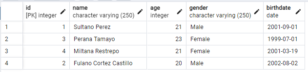

Ahora tenemos una manera de saber los id de nuestros elementos para modificarlos de una manera segura, luego, continuando con complejidad están las siguientes clausulas

- `WHERE` para filtrar los resultados
- `ORDER BY` para ordenar en base a caracteristicas de los resultados
- `DISTINCT` para retonar solo los registros diferentes
- `LIMIT o FETCH` para limitar el número de registros en la respuesta
- `GROUP BY` para agrupar los resultados en base a una caracteristica
- `HAVING` para filtrar los grupos

Miremos un par de ejemplos, por ejemplo, queremos hacer una consulta que retorne solo los usuarios mujeres, es decir, que en gender tengan el valor `Female`. Lo haríamos de la siguiente manera.

```sql
SELECT * FROM tblUser WHERE gender = 'Female';
```

Bien, ahora digamos que queremos organizar todos en orden de su id, para estos casos usamos la clausula ORDER BY, de la siguiente manera.

```sql
SELECT * FROM tblUser ORDER BY id;
```

El orden se puede cambiar con ASC o DESC.

```sql
SELECT * FROM tblUser ORDER BY id DESC;
SELECT * FROM tblUser ORDER BY id ASC;
```

También podemos renombrar los nombres de las columnas, intentemos por ejemplo traer nombre como COMPLETE_NAME y gender como SEX, este concepto es conocido como los áliases, ya lo miraremos a detalle.

```sql
SELECT name as COMPLETE_NAME, gender as SEX FROM tblUser;
```

Esto solo nos retornará dichas dos columnas y con los alías dispuestos.

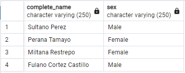

Ahora que tenemos claro el funcionamiento de SELECT y como implementar distintos filtros y clausulas miremos como agrupar tablas para obtener queries con información mas completa.

## Áliases

Los álias pueden ser utilizados como vimos anteriormente para renombrar la manera como referenciamos a columnas y como son expresadas en el resultado de nuestros queries, adicionalmente como veremos en la siguiente sección también pueden ser utilizados para facilitar nuestros queries y para identificar a que columna nos estamos refiriendo cuando tenemos queries complejos que involucran columnas de varias tablas, miremos un ejemplo de cada uno de los tipos de álias que existen.

`Álias de columna`

- Son utilizados en sentencias SELECT
- Se pueden indicar simplemente con palabras en minúscula, si se requiere de agregar simbolos se puede hacer pero tendrá que ser indicado entre comillas
- Pueden ser utilizados para columnas derivadas, es decir, resultado de operaciones entre columnas
- Pueden ser utilizados en sentencias GROUP BY y ORDER BY
- No se pueden utilizar en WHERE o HAVING

```sql
SELECT
	deptno AS "DeptID",
	 SUM(sal) AS "DeptSal"
FROM
	employees
GROUP BY
	"DeptID";
```

Como vemos aquí utilizamos un álias para una columna derivada y así mismo utilizamos uno para el GROUP BY, van entre comillas por la naturaleza de sus nombres según indicamos.

`Álias de tabla`

- Pueden ser utilizadas en sentencias SELECT y FROM para seleccionar columnas de una tabla
- Pueden ser utilizadas en sentencias WHERE, GROUP BY, HAVING y ORDER BY
- Cuando tenemos data de diferentes tablas necesitamos identificar las columnas usando el identificador de tabla álias
- Los álias son obligatorios para queries dentro de queries pues el resultado debe llevar un álias para poder identificarlo

```sql
SELECT
	emp.*
FROM
	employees emp;
```

En el ejemplo anterior llamamos la tabla emp y luego indicamos tomar todo de emp

En la siguiente sección donde veremos los JOIN miraremos nos familiarizaremos mas con los álias de tablas.

## JOIN

Para cruzar tablas hemos mencionado mucho de la utilidad de las llaves foraneas, estas llaves foraneas nos sirven para identificar elementos entre distintas tablas y complementar su información, conforme lo describimos en las tablas City y Country y la manera de conectarlas con sus tablas auxiliares.

Miremos los tipos de uniones o JOIN que existen, empecemos con los siguientes.

- `INNER JOIN`
- `LEFT JOIN`
- `FULL OUTER JOIN`
- `CROSS JOIN`

Miremos como funcionan los tipos de JOIN explicados con la teoria de conjuntos.

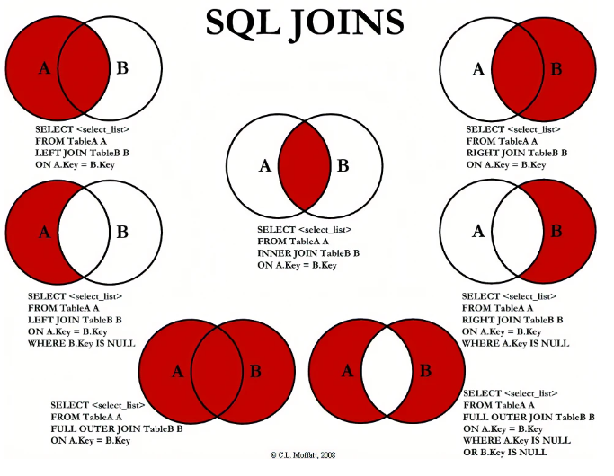

Como vemos dependiendo del JOIN se toma cierta parte del conjunto, siendo A y B dos tablas distintas, las región coloreada sería la que cumple la condición del JOIN, miremos entonces un ejemplo desarrollando la obtención de la Ciudad y País de los usuarios.

Primero iniciamos haciendo un JOIN con la tabla UserCity.

```sql
SELECT
	*
FROM
	tblUser as Users
	INNER JOIN tblUserCity as UserCity
	ON Users.id = UserCity.iduser;
```

Como vemos le asignamos alias a las tablas en el query para no tener que repetir su nombre completo y con la palabra clave ON indicamos la condición para el JOIN, ahora agreguemos otro JOIN con la tabla Ciudad para saber la ciudad.

```sql
SELECT
	*
FROM
	tblUser as Users
	INNER JOIN tblUserCity as UserCity
	ON Users.id = UserCity.iduser
	INNER JOIN tblCity as City
	ON City.id = UserCity.idCity;
```

Ahora agregamos la tabla City y con la tabla auxiliar la relacionamos, de esta manera nos retorna lo siguiente:

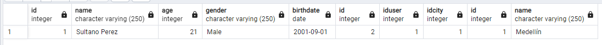

Como vemos retorna toda la información de todas las tablas por el SELECT \*, organicemos un poco la respuesta retornando solo lo necesario.

```sql
SELECT
	Users.name,
	age,
	gender,
	birthdate,
	City.name AS City
FROM
	tblUser as Users
	INNER JOIN tblUserCity as UserCity
	ON Users.id = UserCity.iduser
	INNER JOIN tblCity as City
	ON City.id = UserCity.idCity;
```

Para este caso tanto la tabla City como la tabla User tienen una columna llamada name, si solo pusieramos name en los campos a retornar se generaría un error por ambiguedad, por eso debemos cuando se repitan nombres de columnas indicar de que columna planeamos tomar la propiedad, el resultado se ve así.

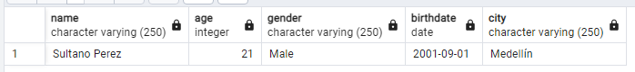

Por último agreguemos los JOIN necesarios para tomar el país.

```sql
SELECT
	Users.name,
	age,
	gender,
	birthdate,
	City.name AS City,
	C.name AS Country
FROM
	tblUser as Users
	INNER JOIN tblUserCity as UserCity
	ON Users.id = UserCity.iduser
	INNER JOIN tblCity as City
	ON City.id = UserCity.idCity
	INNER JOIN tblCityCountry AS CC
	ON CC.idcity = City.id
	INNER JOIN tblCountry AS C
	ON CC.idcountry = C.id;
```

Entonces el resultado final agrega la columna Country la cual tiene el name de la tabla Country.

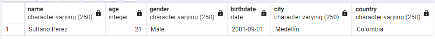

Como evidenciamos en la teoría de conjuntos y el resultado, al utilizar INNER JOIN solo se traen los registros presentes en ambas tablas del cruce, como Sultano es el único usuario que le agregamos una relación con Ciudad y País es el único que retorna, podríamos retornar los demas haciendo uso de la teoría de conjuntos con otros tipos de JOIN pero tendrían las columnas de Ciudad y País vacías.

Miremos ahora algunas otras maneras de conocer los JOIN y otros un poco mas complejos y para necesidades mas especificas.

`EQUI JOIN`

Se le conoce como `EQUI JOIN` a cualquier JOING que involucre igualdad en su condición de unión, es decir, que utilice la palabra `on` para su clausula y contenga una condición de igualdad `=`. Ejemplo.

```sql
SELECT
	agents.agent_name,
	customer.cust_name,
	customer.cust_city
FROM
	agents,
	customer
WHERE
	agents.working_area = customer.cust_city;
```

Como vemos se ejecuta un JOIN a secas pero en la sentencia se utiliza un igual por lo que se considera EQUI JOIN

`NON EQUI JOIN`

Los `NON EQUI JOINS` son lo contrario a los EQUI JOIN, son cualquier tipo de JOIN donde se utilicen comparadores de desigualdad o de comparación en su sentencia ON. Miremos un ejemplo.

```sql
SELECT
	a.ord_num,
	a.ord_amount,
	b.cust_name,
	b.working_area
FROM
	orders a,
	customer b
WHERE
	a.ord_amount BETWEEN b.opening_amt AND b.opening_amt;
```

Como vemos podríamos reemplazar ese BETWEEN por los operadores que representa y tendríamos un JOIN conocido como NON EQUI JOIN.

`NATURAL JOIN`

Los NATURAL JOIN son una subclasificación de los EQUI JOIN, estos indican que son JOIN donde se utiliza el operador de igualdad para comparar y donde las columnas con el mismo nombre van a aparecer solo una vez en el resultado del query. Ejemplo.


Como vemos la columna Company_ID se repite en ambas tablas con el mismo valor y al ser utilizada para el ON se entiende que es un NATURAL JOIN y esta no se visualiza en el resultado, el query sería.

```sql
SELECT
	*
FROM
	foods
NATURAL JOIN
	company;
```

`CROSS JOIN`

Un CROSS JOIN produce un resultado donde el número de filas es el número de filas de la primera tabla por el número de filas de la segunda, si no se utiliza clausula WHERE es un CROSS JOIN, si se utiliza, pasa a ser un INNER JOIN.

Miremos un ejemplo gráfico primero.


Ahora miremos el ejemplo SQL

```sql
SELECT *
FROM table1
CROSS JOIN table2;
```

Luego si tenemos las siguientes tablas.


El cross join se haría con el siguiente código.

```sql
SELECT
	foods.item_name,
	foods.item_unit,
	company.company_name,
	company.company_city
FROM
	foods
	CROSS JOIN company;
```

El resultado es una tabla con los siguientes registros.

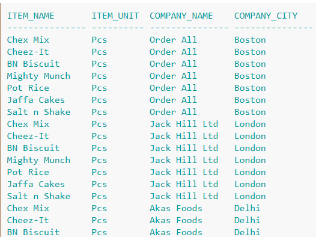

Y esos solo son los iniciales, la tabla sería de n x m con N como registros de la primera tabla y M como los de la segunda.

`SELF JOIN`

Los SELF JOIN como su nombre lo indica son uniones de una tabla con si misma, son especialmente utiles cuando la tabla presenta llaves foraneas que contienen su propia PRIMARY_KEY, cada fila de la tabla será combinada consigo misma y con las demás, la sintaxis es como si se hiciera JOIN con otra tabla pero se usa la misma con un álias para identificar las columnas de la primera y la segunda.

```sql
SELECT a.column_name, b.column_name...
FROM table1 a, table1 b
WHERE a.common_filed = b.common_field;
```

Miremos un ejemplo donde se tiene una tabla de empleados que contiene algunos empleados que son supervisores de otros, entonces, existe una columna llamada EMP_SUPV que hace referencia a la misma PK de la tabla.

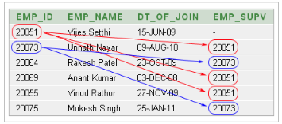

Entonces el query para obtener cada empleado con su supervisor y su nombre sería.

```sql
SELECT
	a.emp_id AS "Emp_ID",
	a.emp_name AS "Employee Name",
	b.emp_id AS "Supervisor ID",
	b.emp_name AS "Supervisor Name"
FROM
	employee a, employee b
WHERE
	a.emp_supv = b.emp_id;
```

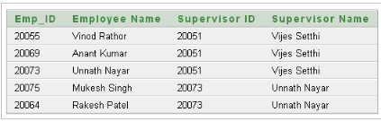

`OUTER JOIN`

El OUTER JOIN retorna todas las filas de ambas tablas que cumplieron la condición de unión mas las que no satisfacieron. Miremos el siguiente ejemplo gráfico que ejemplifica muy bien lo que sucede con este tipo de JOINS.

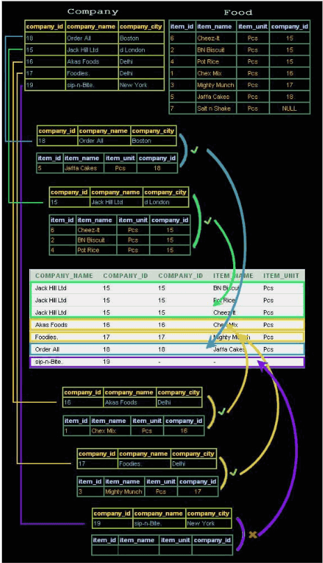

Como vemos luego de unir las tablas para obtener la información de los comestibles hay unas compañias que no tienen productos asociados, sin embargo como el OUTER JOIN las incluye así no cumplan con la clausula en la tabla resultado está presente con la información nula, este se usa como un modificador de LEFT JOIN o RIGHT JOIN dependiendo de la tabla que va a incluir la información que no cumpla.

```sql
SELECT
	company.company_name,
	company.company_id,
	foods.company_id,
	foods.item_name,foods.item_unit
FROM
	company RIGHT OUTER JOIN
	foods
WHERE
	company.company_id = foods.company_id;
```

## Final del módulo

Llegamos al final del módulo de PostgreSQL en el cual vimos todas las operaciones basicas de querys, ahora estamos en condiciones de realizar todo tipo de operaciones en nuestras bases de datos y de generar cualquier tipo de modelo en estas, por supuesto la gestión de base de datos es todo un arte con conceptos mucho mas complejos de optimización y personalización de queries que vale la pena profundizar en caso de quererse especializar en el manejo.

Como lo mencionamos en el módulo anterior las diferencias entre SQL de distintos motores de bases de datos relacionales son muy pocas, sin embargo si queremos intentar pasar a otro motor pese a que ya tenemos experiencia en SQL basico vale la pena repasar las reglas de sintaxis del nuevo motor.

En los siguientes módulos empezaremos con las bases de datos no relacionales, estas tienen un mismo fin pero una implementación un poco diferente.
